---
## Front matter
title: "Отчёт по лабораторной работе №3"
subtitle: "Операционные системы"
author: "Кочарян Никита Робертович

## Generic otions
lang: russian
toc-title: "Содержание"

## Bibliography
bibliography: bib/cite.bib
csl: pandoc/csl/gost-r-7-0-5-2008-numeric.csl

## Pdf output format
toc: true # Table of contents
toc-depth: 2
lof: true # List of figures
lot: true # List of tables
fontsize: 12pt
linestretch: 1.5
papersize: a4
documentclass: scrreprt
## I18n polyglossia
polyglossia-lang:
name: russian
options:
- spelling=modern
- babelshorthands=true
polyglossia-otherlangs:
name: english
## I18n babel
babel-lang: russian
babel-otherlangs: english
## Fonts
mainfont: PT Serif
romanfont: PT Serif
sansfont: PT Sans
monofont: PT Mono
mainfontoptions: Ligatures=TeX
romanfontoptions: Ligatures=TeX
sansfontoptions: Ligatures=TeX,Scale=MatchLowercase
monofontoptions: Scale=MatchLowercase,Scale=0.9
## Biblatex
biblatex: true
biblio-style: "gost-numeric"
biblatexoptions:
- parentracker=true
- backend=biber
- hyperref=auto
- language=auto
- autolang=other*
- citestyle=gost-numeric
## Pandoc-crossref LaTeX customization
figureTitle: "Рис."
tableTitle: "Таблица"
listingTitle: "Листинг"
lofTitle: "Список иллюстраций"
lotTitle: "Список таблиц"
lolTitle: "Листинги"
## Misc options
indent: true
header-includes:
- \usepackage{indentfirst}
- \usepackage{float} # keep figures where there are in the text
- \floatplacement{figure}{H} # keep figures where there are in the text
---

# Цель работы

Научиться оформлять отчёты с помощью легковесного языка разметки Markdown.

# Задание

- Сделать отчет по предыдущей лабораторной работе в формате Markdown.
- В качестве отчёта предоставить отчёты в 3 форматах: pdf, docx и md.

# Выполнение лабораторной работы

1.  Установка git(рис. [@fig:001]).

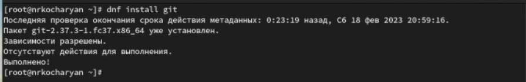{#fig:001 width=90%}

2.  Установка gh(рис. [@fig:002]).

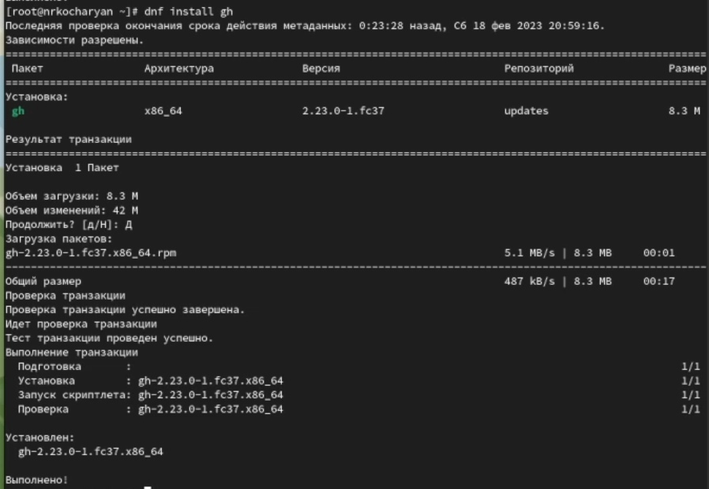{#fig:002 width=90%}

3.  Базовая настройка гит: задаем имя и email владельца репозитория, настройка utf-8 в выводе сообщений git(рис. [@fig:003]) 

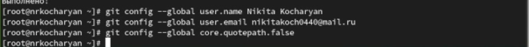{#fig:003 width=90%}

4.  Базовая настройка гит: задаем имя начальной ветки, параметр autocrlf, параметр safecrlf(рис. [@fig:004])

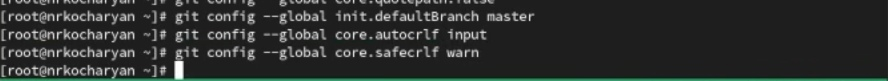{#fig:004 width=90%}

5.  Создание ssh ключа по алгоритму rsa с ключём размером 4096 бит(рис. [@fig:005])

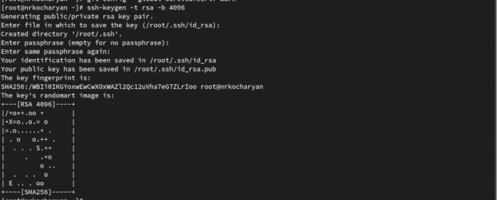{#fig:005 width=90%}

6.  Создание shh ключа по алгоритму erd25519(рис. [@fig:006])

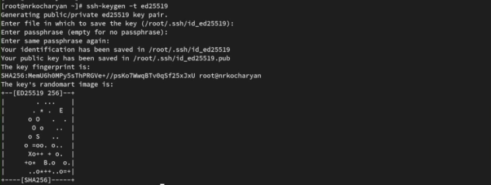{#fig:006 width=90%}

7.  Генерация ключа pgp(рис. [@fig:007])

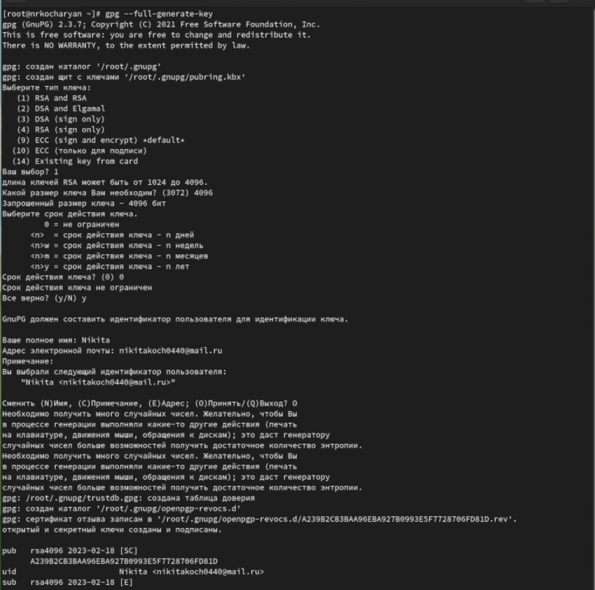{#fig:007 width=90%}

8. Выводим список ключей и копируем отпечаток приватного ключа(рис. [@fig:008])

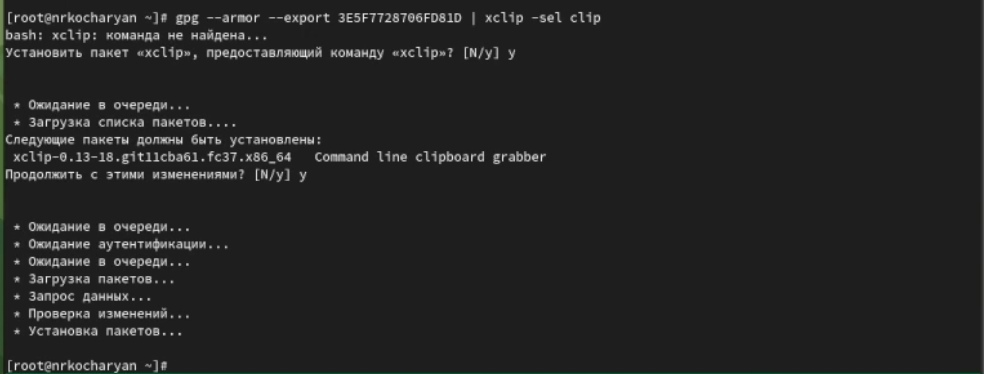{#fig:008 width=90%}

9.  В настройках github добавляем полученный ключ(рис. [@fig:009])

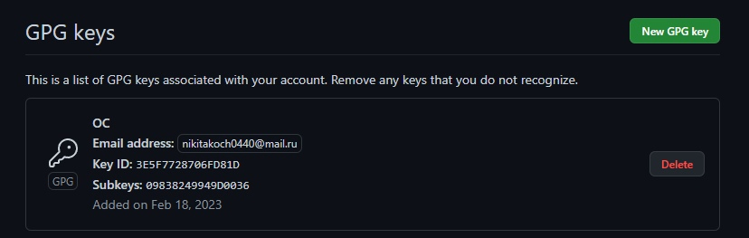{#fig:009 width=90%}

10. Используя введенный email, указываем Git применять его при подписи коммитов(рис. [@fig:010])

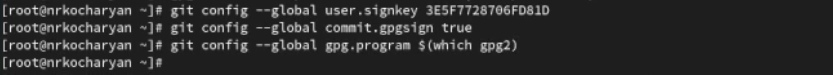{#fig:010 width=90%}

11. Авторизовываемся на аккаунт github(рис. [@fig:011])

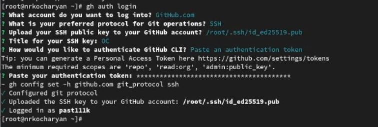{#fig:011 width=90%}

12. Создаем каталог и переходим в него(рис. [@fig:012])

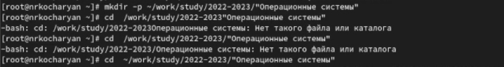{#fig:012 width=90%}

13. Создаем репозиторий на основе другого репозитория(рис. [@fig:013])

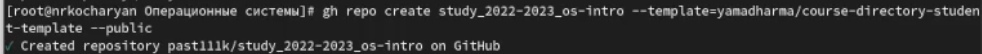{#fig:013 width=90%}

14. Клонируем в os-intro(рис. [@fig:014])

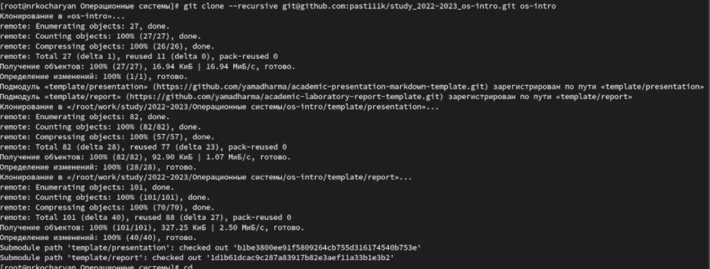{#fig:014 width=90%}

15. Переходим в каталог курса и удаляем лишние файлы(рис. [@fig:015])

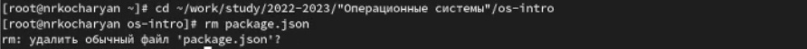{#fig:015 width=90%}

16. Создаем необходимые каталоги(рис. [@fig:016])

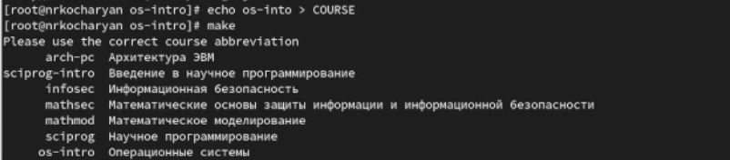{#fig:016 width=90%}

# Выводы

Благодаря данной лабораторной работе мы научились оформлять отчёты с помощью языка разметки Markdown.

# Список литературы{.unnumbered}

::: {#refs}
:::
