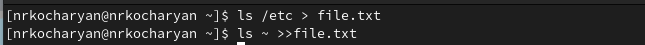
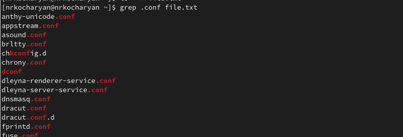
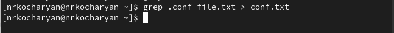
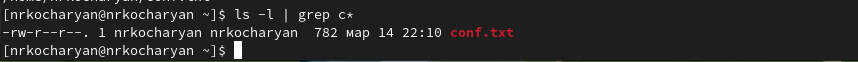
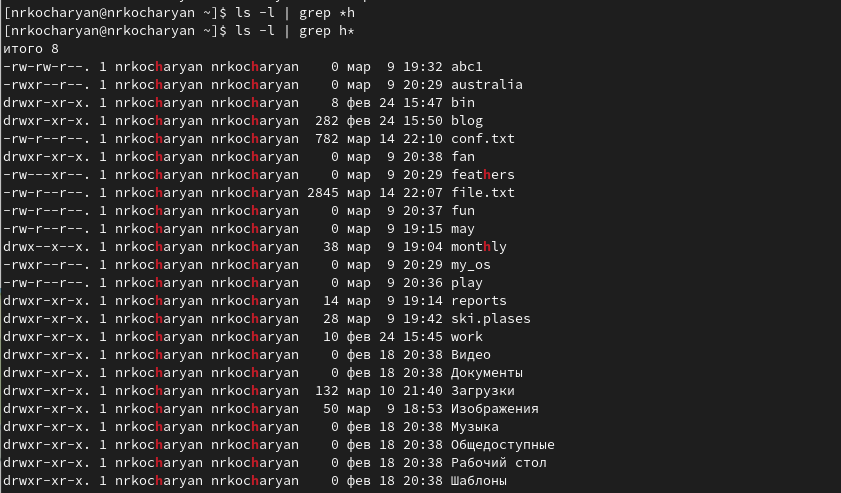
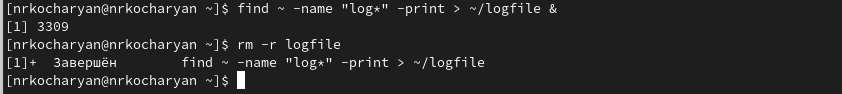
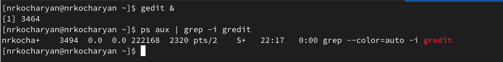
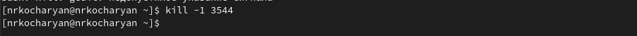
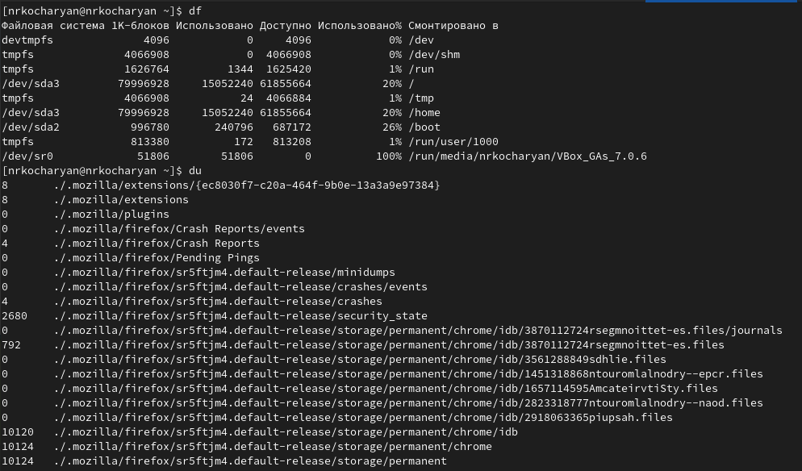
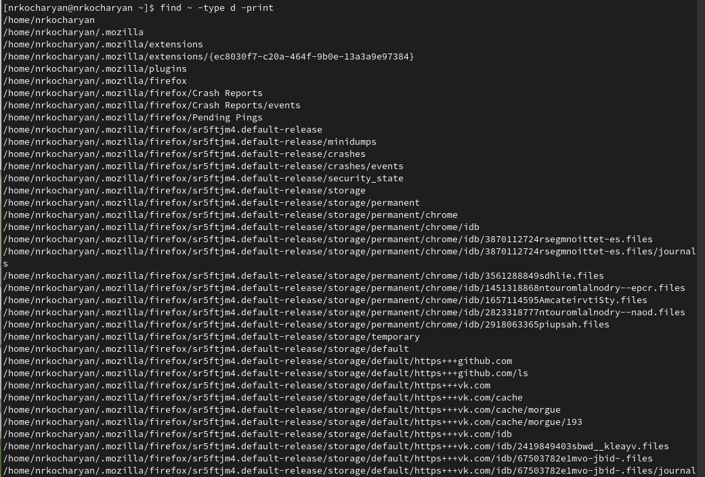

---
## Front matter
lang: ru-RU
title: Лабораторная работа № 6
subtitle: Поиск файлов. Перенаправление ввода-вывода. Просмотр запущенных процессов.
author:
  - Кочарян Никита Робертович
institute:
  - Российский университет дружбы народов, Москва, Россия
date: 15 марта 2023

## i18n babel
babel-lang: russian
babel-otherlangs: english

## Formatting pdf
toc: false
toc-title: Содержание
slide_level: 2
aspectratio: 169
section-titles: true
theme: metropolis
header-includes:
 - \metroset{progressbar=frametitle,sectionpage=progressbar,numbering=fraction}
 - '\makeatletter'
 - '\beamer@ignorenonframefalse'
 - '\makeatother'
---

# Информация

## Докладчик

:::::::::::::: {.columns align=center}
::: {.column width="70%"}

  * Кочарян Никита Робертович
  * Студент группы НБибд-04-22
  * Российский университет дружбы народов


:::
::: {.column width="30%"}

:::
::::::::::::::

## Цели и задачи

- Ознакомление с инструментами поиска файлов и фильтрации текстовых данных.
Приобретение практических навыков: по управлению процессами (и заданиями), по
проверке использования диска и обслуживанию файловых систем

## Выполнение лабораторной работы

1. Записываю в файл file.txt названия файлов, содержащихся в каталоге /etc. Дописываю в этот же файл названия файлов, содержащихся в моём домашнем каталоге.

{#fig:001 width=90%}

##

2.	Вывожу имена всех файлов из file.txt, имеющих расширение .conf, после чего записываю их в новый текстовой файл conf.txt	

{#fig:002 width=50%}
{#fig:003 width=50%}

##

3.	Определяю, какие файлы в вашем домашнем каталоге имеют имена, начинавшиеся с символа c

{#fig:004 width=50%}
{#fig:005 width=50%}

##

4.	Вывожу на экран (по странично) имена файлов из каталога /etc, начинающиеся с символа h.

{#fig:006 width=90%}

##

5.	Запускаем в фоновом режиме процесс, который будет записывать в файл ~/logfile файлы, имена которых начинаются с log ; удаляем файл ~/logfile

{#fig:007 width=90%}

##

6.	Запускаем из консоли в фоноом режиме редактор gedit ; опеределяем идентификатор процесса gedit, используя команду ps, конвейр и фильтр grep 

{#fig:008 width=90%}

##

7.	Прочитав справку(man) команды kill, использую её для завершения процесса gedit

{#fig:009 width=90%}

##

8.	Выполняю команды df и du, предварительно получив более подробную информацию об этих командах, с помощью команды man

##

{#fig:010 width=90%}

9.	Воспользовавшись справкой команды find, вывожу имена всех директорий, имеющихся в вашем домашнем каталоге.

{#fig:011 width=90%}

##

## Формат `pdf`

- Использование LaTeX
- Пакет для презентации: [beamer](https://ctan.org/pkg/beamer)
- Тема оформления: `metropolis`

## Код для формата `pdf`

```yaml
slide_level: 2
aspectratio: 169
section-titles: true
theme: metropolis
```

## Формат `html`

- Используется фреймворк [reveal.js](https://revealjs.com/)
- Используется [тема](https://revealjs.com/themes/) `beige`

## Код для формата `html`

- Тема задаётся в файле `Makefile`

```make
REVEALJS_THEME = beige 
```

## Результаты

В ходе выполнения лабораторной работы №6 я ознакомился с инструментами поиска файлов и фильтрации текствовых данных. Приобрел практические навыки по управдению процессами и заданиями по проверке использования диска и обслуживанию файловых систем.

