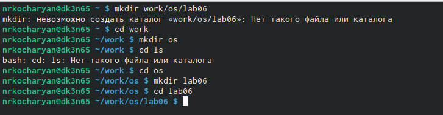
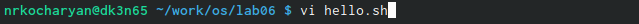
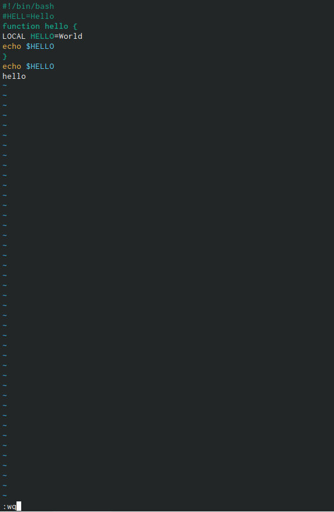
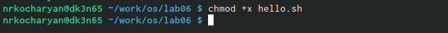
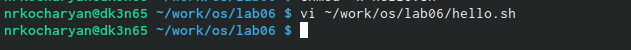
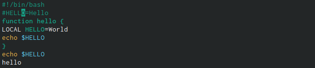
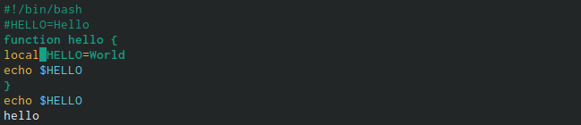
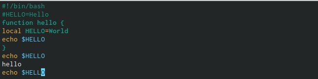
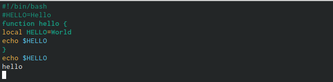
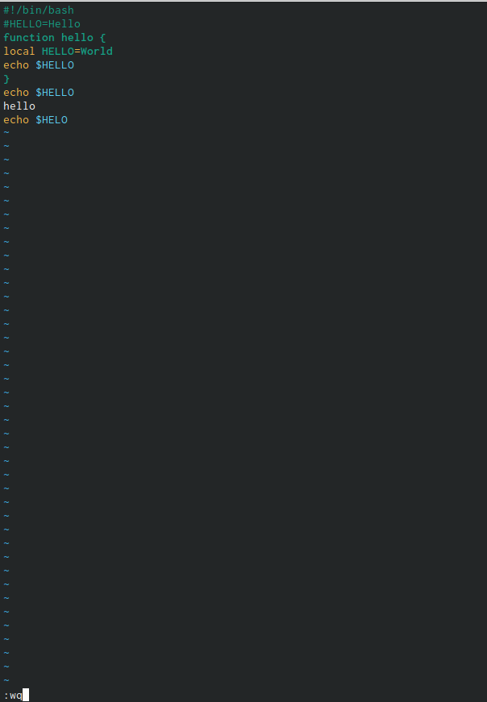

---
## Front matter
lang: ru-RU
title: Лабораторная работа № 8
subtitle: Текстовый редактор vi
author:
  - Кочарян Никита Робертович
institute:
  - Российский университет дружбы народов, Москва, Россия
date: 30 марта 2023

## i18n babel
babel-lang: russian
babel-otherlangs: english

## Formatting pdf
toc: false
toc-title: Содержание
slide_level: 2
aspectratio: 169
section-titles: true
theme: metropolis
header-includes:
 - \metroset{progressbar=frametitle,sectionpage=progressbar,numbering=fraction}
 - '\makeatletter'
 - '\beamer@ignorenonframefalse'
 - '\makeatother'
---

# Информация

## Докладчик

:::::::::::::: {.columns align=center}
::: {.column width="70%"}

  * Кочарян Никита Робертович
  * Студент группы НБибд-04-22
  * Российский университет дружбы народов

:::
::: {.column width="30%"}

:::
::::::::::::::

## Цели и задачи

- Познакомиться с операционной системой Linux. Получить практические навыки рабо-
ты с редактором vi, установленным по умолчанию практически во всех дистрибутивах.

## Выполнение лабораторной работы

1.	Создаю каталог с именем ~/work/os/lab06  и перехожу в него 

{#fig:001 width=90%}

##

2.	Вызываю vi и создаю файл hello.sh

{#fig:002 width=90%}

##

3.	Нажимаю клавишу "i" и ввожу следующий текст #!/bin/bash HELL=Hello function hello { LOCAL HELLO=World echo $HELLO } echo $HELLO hello ; нажимаю клавишу "Esc" для перехода в командный режим после завершения ввода текста.

{#fig:003 width=90%}

##

4.	Нажимаю ":" для перехода в режим последней строки; нажимаю w(записать) и q(выйти), а затем нажимаю клавишу "Enter" для сохранения моего текста и завершения работы

{#fig:004 width=90%}

##

5.	Делаю файл исполняемым

{#fig:005 width=90%}

##

6.	Вызываю vi на редактирование файла 

{#fig:006 width=90%}

##

7.	Устанавливаю курсор в конце слова HELL второй строки, перехожу в режим вставки и заменяю на HELLO ; нажимаю "Esc" для возврата в команднйы режим

{#fig:007 width=90%}

##

8.	Уставливаю курсор на четвертую строку и стираю слово LOCAL ; перехожу в режим вставки и набераю текст : local ; нажимаю "Esc" для возварта в командный режим

{#fig:008 width=90%}

##

9.	Установливаю курсор на последней строке файла. Вставляю после неё строку, содержащую
следующий текст: echo $HELLO.

{#fig:009 width=90%}

##

10.	Нажимаю "Esc" для перехода в командный режим. Удалите последнюю строку.

{#fig:010 width=90%}

##

11.	Ввожу команду отмены изменений "u" для отмены последней команды. Введите символ ":" для перехода в режим последней строки. Запишите произведённые изменения и выйдите из vi.

{#fig:011 width=90%}

## Результаты

В ходе выполнения лабораторной работы №7 я ознакомился с командной оболочки Midnight Commander, приобрел навыки практической работы по просмотру каталогов и файлов, манипуляций с ними.

