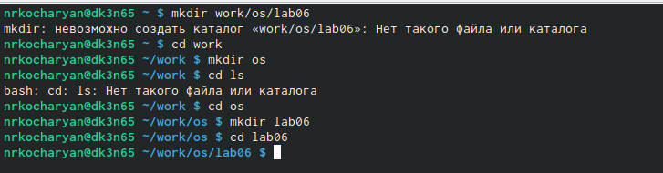
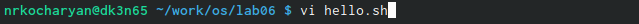
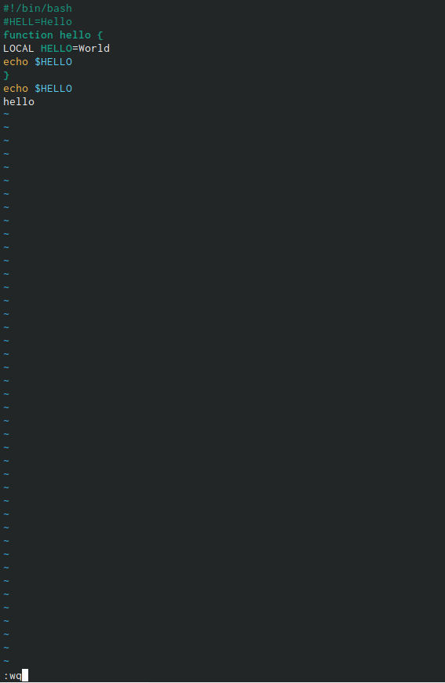
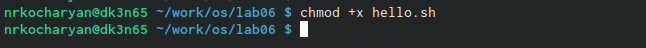
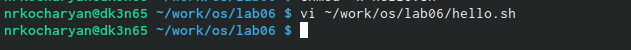
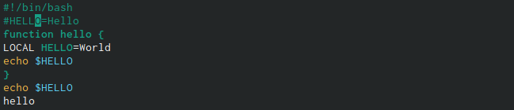
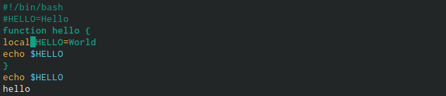
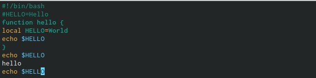
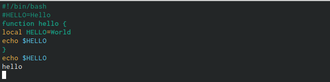
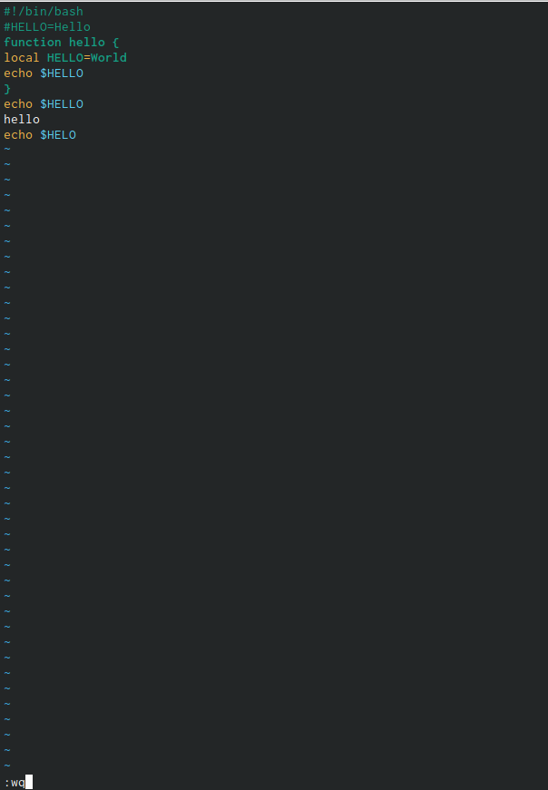

---
## Front matter
title: "Лабораторная работа №8. Текстовый редактор vi."
subtitle: "Операционые системы"
author: "Кочарян Никита Робертович"

## Generic otions
lang: ru-RU
toc-title: "Содержание"

## Bibliography
bibliography: bib/cite.bib
csl: pandoc/csl/gost-r-7-0-5-2008-numeric.csl

## Pdf output format
toc: true # Table of contents
toc-depth: 2
lof: true # List of figures
lot: true # List of tables
fontsize: 12pt
linestretch: 1.5
papersize: a4
documentclass: scrreprt
## I18n polyglossia
polyglossia-lang:
  name: russian
  options:
	- spelling=modern
	- babelshorthands=true
polyglossia-otherlangs:
  name: english
## I18n babel
babel-lang: russian
babel-otherlangs: english
## Fonts
mainfont: PT Serif
romanfont: PT Serif
sansfont: PT Sans
monofont: PT Mono
mainfontoptions: Ligatures=TeX
romanfontoptions: Ligatures=TeX
sansfontoptions: Ligatures=TeX,Scale=MatchLowercase
monofontoptions: Scale=MatchLowercase,Scale=0.9
## Biblatex
biblatex: true
biblio-style: "gost-numeric"
biblatexoptions:
  - parentracker=true
  - backend=biber
  - hyperref=auto
  - language=auto
  - autolang=other*
  - citestyle=gost-numeric
## Pandoc-crossref LaTeX customization
figureTitle: "Рис."
tableTitle: "Таблица"
listingTitle: "Листинг"
lofTitle: "Список иллюстраций"
lotTitle: "Список таблиц"
lolTitle: "Листинги"
## Misc options
indent: true
header-includes:
  - \usepackage{indentfirst}
  - \usepackage{float} # keep figures where there are in the text
  - \floatplacement{figure}{H} # keep figures where there are in the text
---

# Цель работы

Познакомиться с операционной системой Linux. Получить практические навыки рабо-
ты с редактором vi, установленным по умолчанию практически во всех дистрибутивах.

# Задания

1. Создайте каталог с именем ~/work/os/lab06.
2. Перейдите во вновь созданный каталог.
3. Вызовите vi и создайте файл hello.sh
4. Нажмите клавишу i и вводите следующий текст.
 #!/bin/bash
 HELL=Hello
 function hello {
 LOCAL HELLO=World
 echo $HELLO
 }
 echo $HELLO
 hello
5. Нажмите клавишу Esc для перехода в командный режим после завершения ввода
текста.
6. Нажмите : для перехода в режим последней строки и внизу вашего экрана появится
приглашение в виде двоеточия.
7. Нажмите w (записать) и q (выйти), а затем нажмите клавишу Enter для сохранения
вашего текста и завершения работы.
8. Сделайте файл исполняемым
 chmod +x hello.sh
9. Вызовите vi на редактирование файла
 vi ~/work/os/lab06/hello.sh
10. Установите курсор в конец слова HELL второй строки.
11. Перейдите в режим вставки и замените на HELLO. Нажмите Esc для возврата в команд-
ный режим.
12. Установите курсор на четвертую строку и сотрите слово LOCAL.
13. Перейдите в режим вставки и наберите следующий текст: local, нажмите Esc для
возврата в командный режим.
14. Установите курсор на последней строке файла. Вставьте после неё строку, содержащую
следующий текст: echo $HELLO.
15. Нажмите Esc для перехода в командный режим.
16. Удалите последнюю строку.
17. Введите команду отмены изменений u для отмены последней команды.
18. Введите символ : для перехода в режим последней строки. Запишите произведённые
изменения и выйдите из vi.

# Выполнение лабораторной работы

1.	Создаю каталог с именем ~/work/os/lab06  и перехожу в него 

{#fig:001 width=90%}

2.	Вызываю vi и создаю файл hello.sh

{#fig:002 width=90%}

3.	Нажимаю клавишу "i" и ввожу следующий текст #!/bin/bash HELL=Hello function hello { LOCAL HELLO=World echo $HELLO } echo $HELLO hello ; нажимаю клавишу "Esc" для перехода в командный режим после завершения ввода текста.

{#fig:003 width=90%}

4.	Нажимаю ":" для перехода в режим последней строки; нажимаю w(записать) и q(выйти), а затем нажимаю клавишу "Enter" для сохранения моего текста и завершения работы

{#fig:004 width=90%}

5.	Делаю файл исполняемым

{#fig:005 width=90%}

6.	Вызываю vi на редактирование файла 

{#fig:006 width=90%}

7.	Устанавливаю курсор в конце слова HELL второй строки, перехожу в режим вставки и заменяю на HELLO ; нажимаю "Esc" для возврата в команднйы режим

{#fig:007 width=90%}

8.	Уставливаю курсор на четвертую строку и стираю слово LOCAL ; перехожу в режим вставки и набераю текст : local ; нажимаю "Esc" для возварта в командный режим

{#fig:008 width=90%}

9.	Установливаю курсор на последней строке файла. Вставляю после неё строку, содержащую
следующий текст: echo $HELLO.

{#fig:009 width=90%}

10.	Нажимаю "Esc" для перехода в командный режим. Удалите последнюю строку.

{#fig:010 width=90%}

11.	Ввожу команду отмены изменений "u" для отмены последней команды. Введите символ ":" для перехода в режим последней строки. Запишите произведённые изменения и выйдите из vi.

{#fig:011 width=90%}

# Контрольные вопросы

1. Дайте краткую характеристику режимам работы редактора vi.
2. Как выйти из редактора, не сохраняя произведённые изменения?
3. Назовите и дайте краткую характеристику командам позиционирования.
4. Что для редактора vi является словом?
5. Каким образом из любого места редактируемого файла перейти в начало (конец)
файла?
6. Назовите и дайте краткую характеристику основным группам команд редактирова-
ния.
7. Необходимо заполнить строку символами $. Каковы ваши действия?
8. Как отменить некорректное действие, связанное с процессом редактирования?
9. Назовите и дайте характеристику основным группам команд режима последней стро-
ки.
10. Как определить, не перемещая курсора, позицию, в которой заканчивается строка?
11. Выполните анализ опций редактора vi (сколько их, как узнать их назначение и т.д.).
12. Как определить режим работы редактора vi?
13. Постройте граф взаимосвязи режимов работы редактора vi.

# Выводы

В ходе выполнения лабораторной работы №8 я ознакомился с операционной системой Linux. Получить практические навыки работы с редактором vi, установленным по умолчанию практически по всех дистрибутивах

