---
## Front matter
lang: ru-RU
title: Лабораторная работа № 9
subtitle: Текстовый редактор emacs
author:
  - Кочарян Никита Робертович
institute:
  - Российский университет дружбы народов, Москва, Россия
date: 6 апреля 2023

## i18n babel
babel-lang: russian
babel-otherlangs: english

## Formatting pdf
toc: false
toc-title: Содержание
slide_level: 2
aspectratio: 169
section-titles: true
theme: metropolis
header-includes:
 - \metroset{progressbar=frametitle,sectionpage=progressbar,numbering=fraction}
 - '\makeatletter'
 - '\beamer@ignorenonframefalse'
 - '\makeatother'
---

# Информация

## Докладчик

:::::::::::::: {.columns align=center}
::: {.column width="70%"}

  * Кочарян Никита Робертович
  * Студент группы НБибд-04-22
  * Российский университет дружбы народов

:::
::: {.column width="30%"}

:::
::::::::::::::

## Цели и задачи

- Познакомиться с операционной системой Linux. Получить практические навыки рабо-
ты с редактором Emacs.

## Выполнение лабораторной работы

1.	Открываю emacs

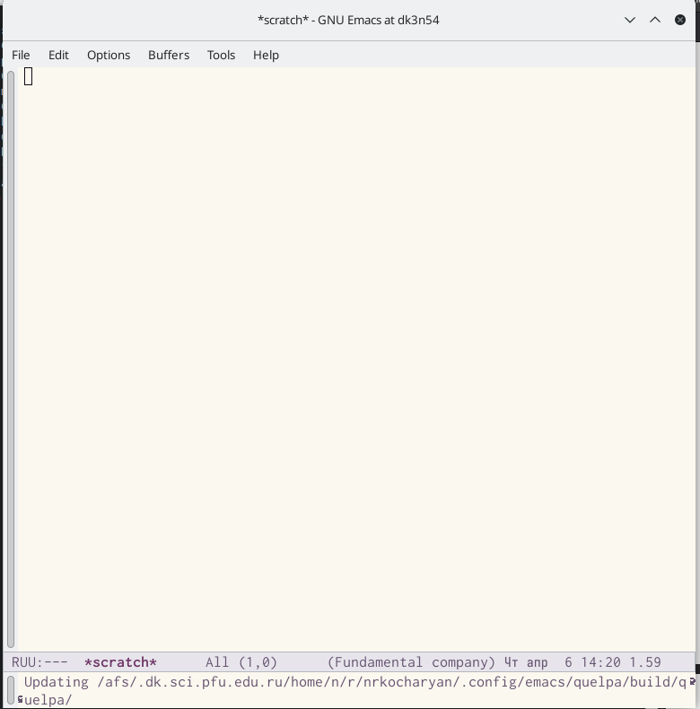{#fig:001 width=90%}

##

2.	Создаю файл lab07.sh с помощью комбинации ctrl-x ctrl-f и набираю туда текст #!/bin/bash HELL=Hello function hello LOCAL HELLO=World echo $HELLO }echo $HELLO hello ; сохраня файл с помощью комбинации ctrl-x ctrl-s

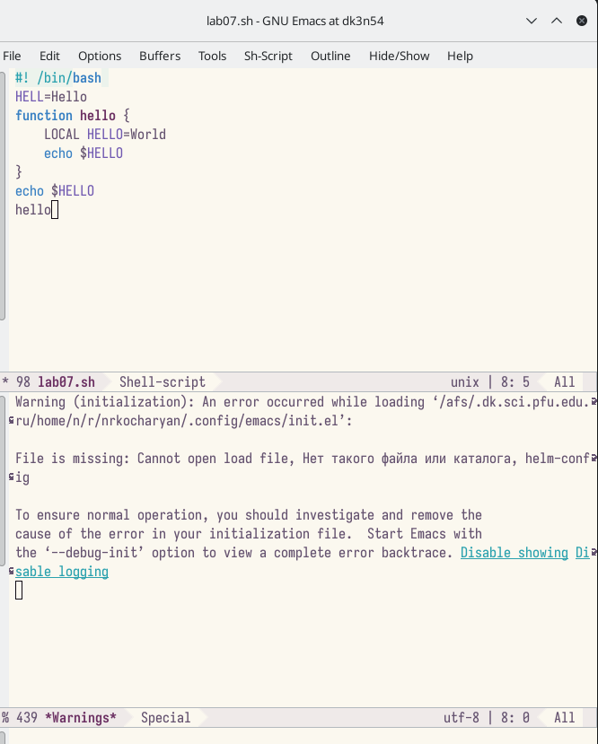{#fig:002 width=90%}

##

3.	Вырезаю одной командой целую строку(C-k);вставляю эту строку в конец файла(C-y).

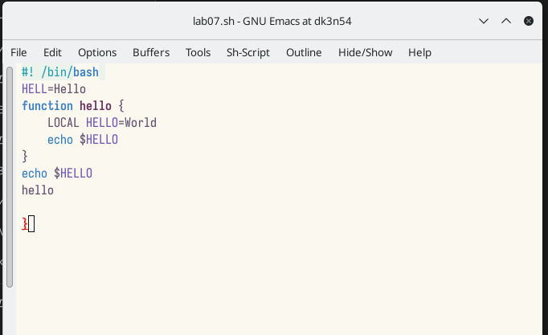{#fig:003 width=90%}

##

4.	Выделяю область текста(C-space); копирую облать в буфер обмена(M-w); вставляю область в конец файла

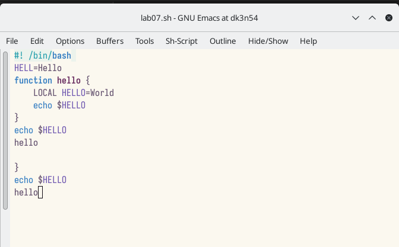{#fig:004 width=90%}

##

5.	Вновь выделяю эту область и на этот раз вырезаю ее(C-w).

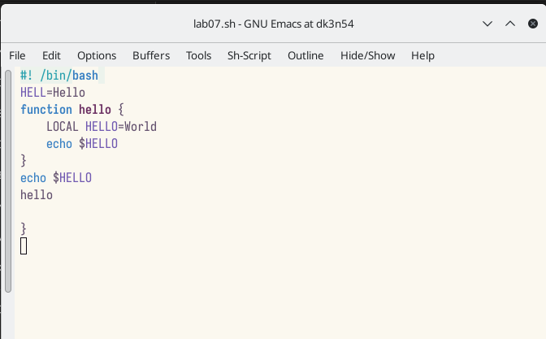{#fig:005 width=90%}

##

6.	Отменяю последнее действие (C-/).

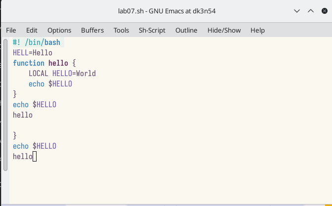{#fig:006 width=90%}

##

7.	Перемещаю курсор в началос строки(C-a).

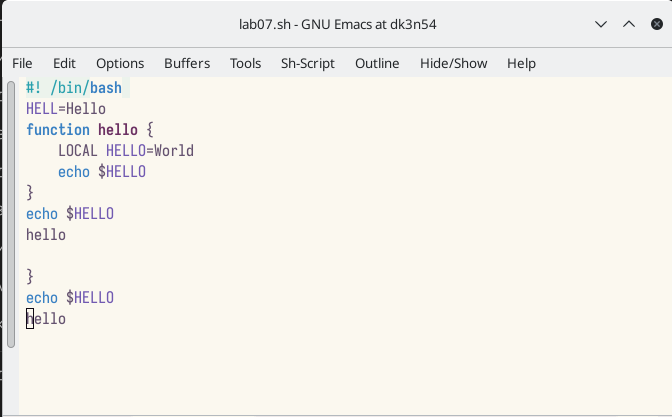{#fig:007 width=90%}

##

8.	Перемещаю курсор в конец строки(C-e).

{#fig:008 width=90%}

##

9.	Перемещаю курсор в начало буфера(M-<).

##

10.	Перемещаю курсор в конец буфера(M->0.

##

11.	Вывести список активных буфферов на экран(C-x C-b).

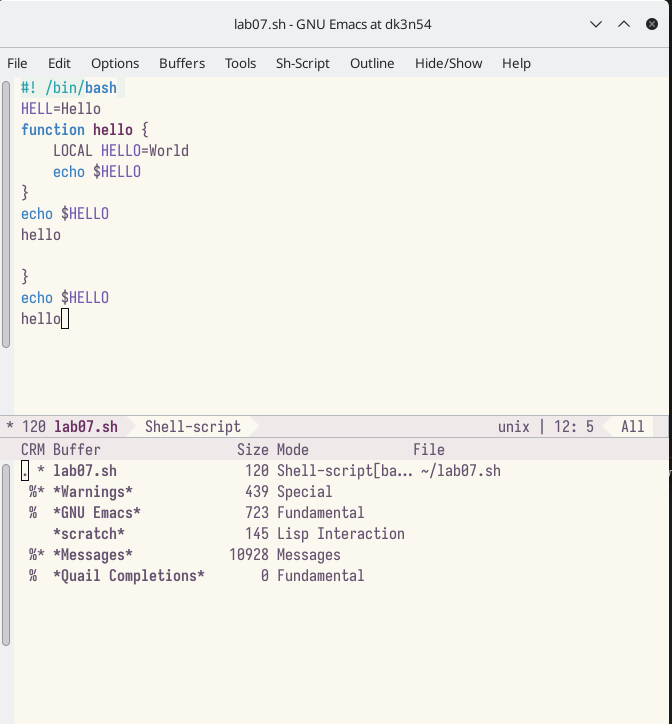{#fig:009 width=90%}

##

12.	Перемещаюсь во вновь открытое окно (C-x) со списком открытых буферов и переключитесь на другой буфер. 

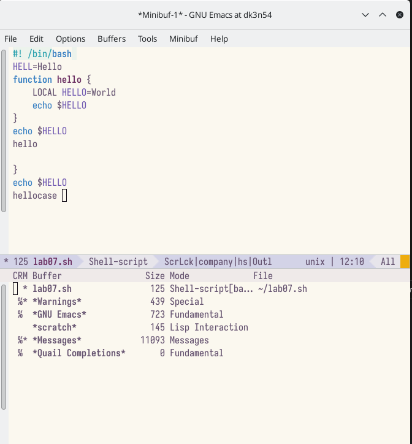{#fig:010 width=90%}

##

13.	Закрываю это окно(C-x 0); Теперь вновь переключаюсь между буферами, мо уже без вывода их списка на экран (C-x b).

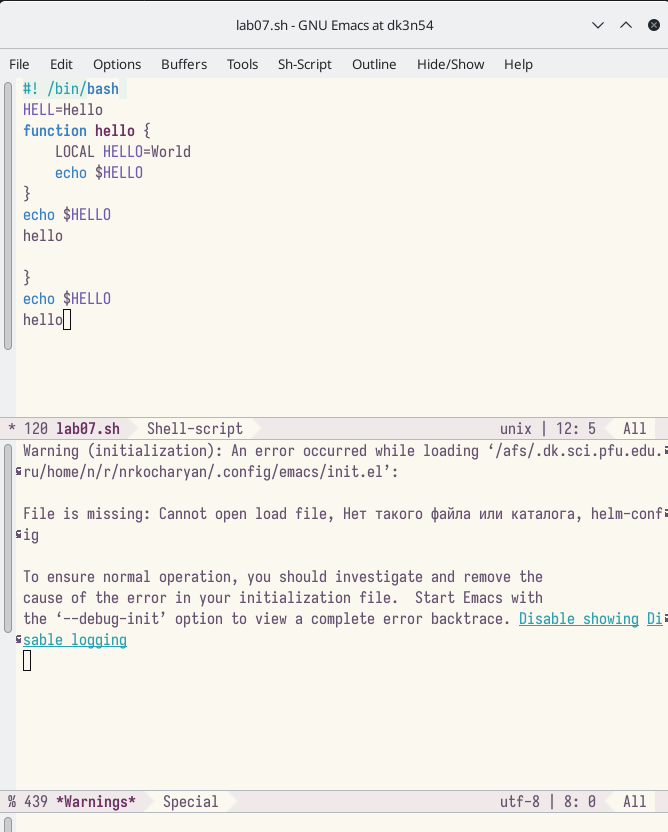{#fig:011 width=90%}

##

14.	Делю фрейм на 4 части: разделите фрейм на два окна по вертикали (C-x 3), а затем каждое из этих окон на две части по горизонтали (C-x 2); В каждом из четырёх созданных окон открываю новый буфер (файл) и ввожу несколько строк текста.

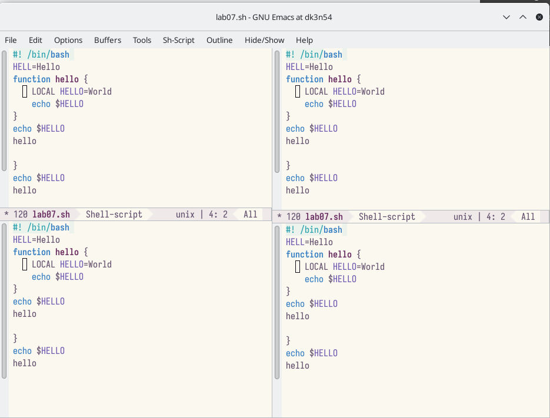{#fig:012 width=90%}

##

15.	Переключаюсь в режим поиска (C-s) и нахожу несколько слов, присутствующих в тексте.э

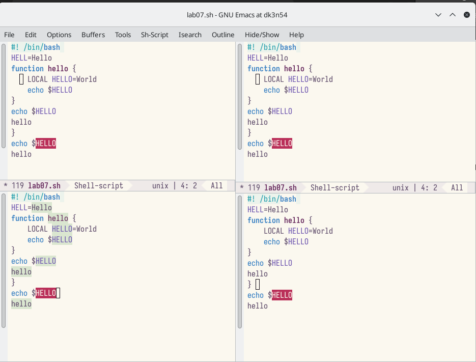{#fig:013 width=90%}

##

16.	Переключаюсь между результатами поиска, нажимая (C-s); выхожу из режима поиска, нажав C-g.

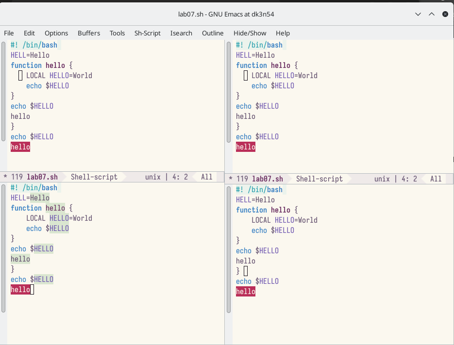{#fig:014 width=90%}

##

17.	Перехожу в режим поиска и замены (M-%), ввожу текст, который следует найти и заменить, нажимаю Enter , затем ввожу текст для замены. После того как будут подсвечены результаты поиска, нажимаю ! для подтверждения замены.

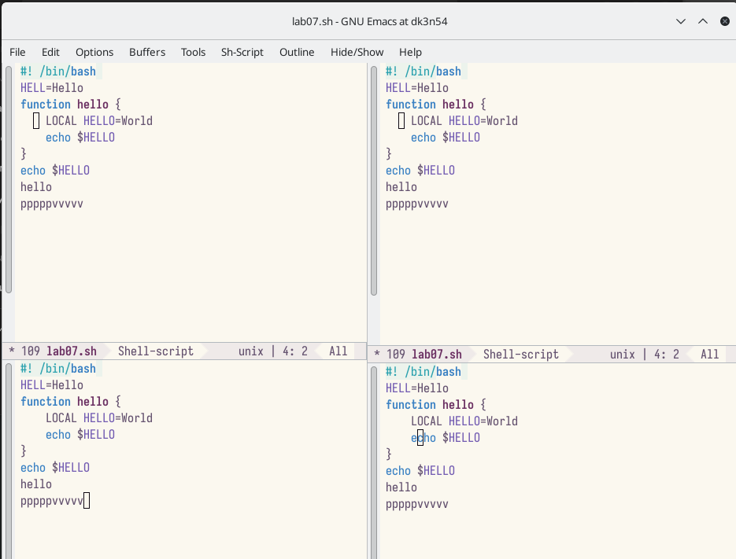{#fig:015 width=90%}

##

18.	Пробую другой режим поиска, нажав M-s o.

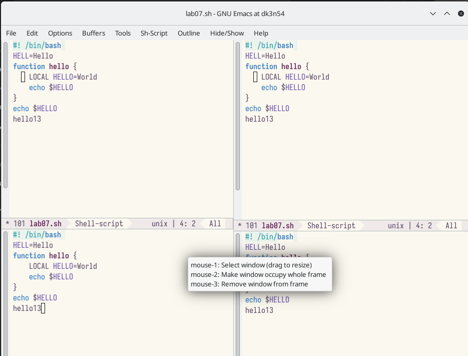{#fig:016 width=90%}

## Результаты

В ходе выполнения лабораторной работы №9 я ознакомился с операциоонной системой Linux. Получить практические навыки работы с редактором emacs
