---
## Front matter
title: "Лабораторная работа №9. Текстовый редактор emacs."
subtitle: "Операционые системы"
author: "Кочарян Никита Робертович"

## Generic otions
lang: ru-RU
toc-title: "Содержание"

## Bibliography
bibliography: bib/cite.bib
csl: pandoc/csl/gost-r-7-0-5-2008-numeric.csl

## Pdf output format
toc: true # Table of contents
toc-depth: 2
lof: true # List of figures
lot: true # List of tables
fontsize: 12pt
linestretch: 1.5
papersize: a4
documentclass: scrreprt
## I18n polyglossia
polyglossia-lang:
  name: russian
  options:
	- spelling=modern
	- babelshorthands=true
polyglossia-otherlangs:
  name: english
## I18n babel
babel-lang: russian
babel-otherlangs: english
## Fonts
mainfont: PT Serif
romanfont: PT Serif
sansfont: PT Sans
monofont: PT Mono
mainfontoptions: Ligatures=TeX
romanfontoptions: Ligatures=TeX
sansfontoptions: Ligatures=TeX,Scale=MatchLowercase
monofontoptions: Scale=MatchLowercase,Scale=0.9
## Biblatex
biblatex: true
biblio-style: "gost-numeric"
biblatexoptions:
  - parentracker=true
  - backend=biber
  - hyperref=auto
  - language=auto
  - autolang=other*
  - citestyle=gost-numeric
## Pandoc-crossref LaTeX customization
figureTitle: "Рис."
tableTitle: "Таблица"
listingTitle: "Листинг"
lofTitle: "Список иллюстраций"
lotTitle: "Список таблиц"
lolTitle: "Листинги"
## Misc options
indent: true
header-includes:
  - \usepackage{indentfirst}
  - \usepackage{float} # keep figures where there are in the text
  - \floatplacement{figure}{H} # keep figures where there are in the text
---

# Цель работы

Познакомиться с операционной системой Linux. Получить практические навыки рабо-
ты с редактором emacs.

# Задания

1. Ознакомиться с теоретическим материалом.
2. Ознакомиться с редактором emacs.
3. Выполнить упражнения.
4. Ответить на контрольные вопросы.

# Выполнение лабораторной работы

1.	Открываю emacs

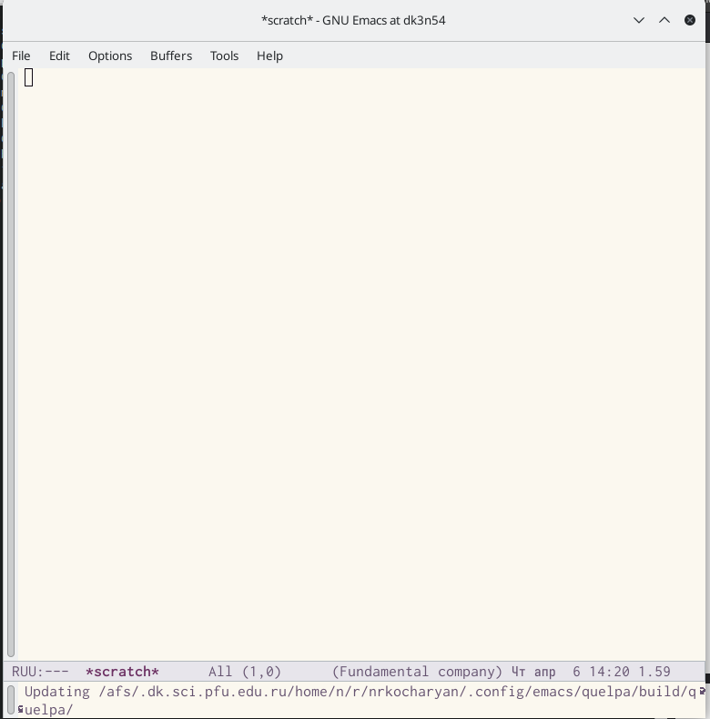{#fig:001 width=90%}

2.	Создаю файл lab07.sh с помощью комбинации ctrl-x ctrl-f и набираю туда текст #!/bin/bash HELL=Hello function hello LOCAL HELLO=World echo $HELLO }echo $HELLO hello ; сохраня файл с помощью комбинации ctrl-x ctrl-s

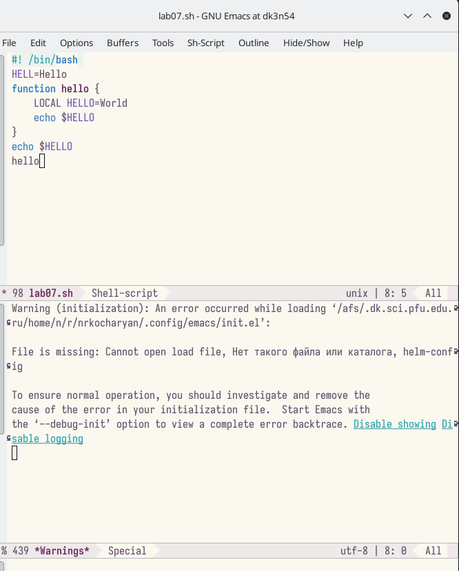{#fig:002 width=90%}

3.	Вырезаю одной командой целую строку(C-k);вставляю эту строку в конец файла(C-y).

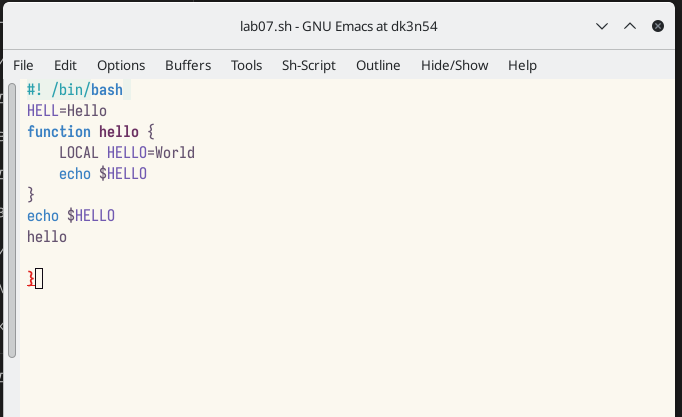{#fig:003 width=90%}

4.	Выделяю область текста(C-space); копирую облать в буфер обмена(M-w); вставляю область в конец файла

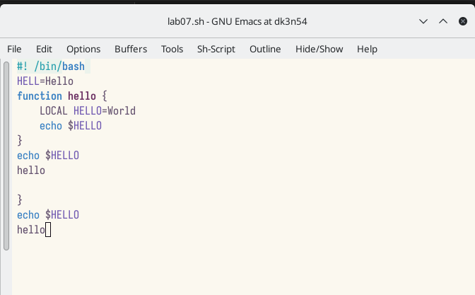{#fig:004 width=90%}

5.	Вновь выделяю эту область и на этот раз вырезаю ее(C-w).

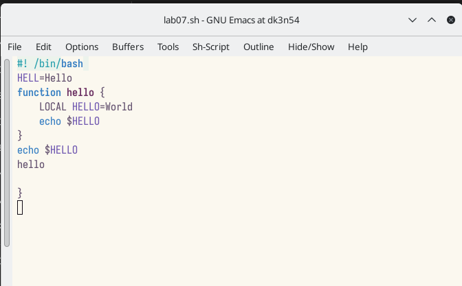{#fig:005 width=90%}

6.	Отменяю последнее действие (C-/).

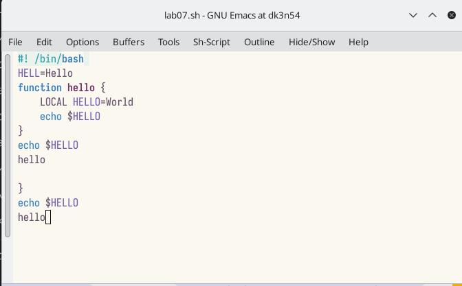{#fig:006 width=90%}

7.	Перемещаю курсор в началос строки(C-a).

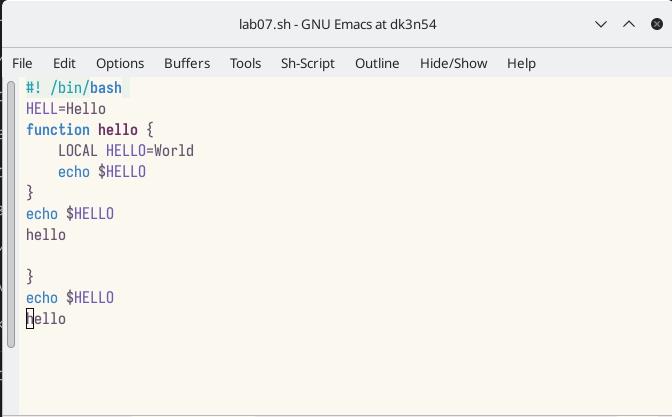{#fig:007 width=90%}

8.	Перемещаю курсор в конец строки(C-e).

{#fig:008 width=90%}

9.	Перемещаю курсор в начало буфера(M-<).

10.	Перемещаю курсор в конец буфера(M->0.

11.	Вывести список активных буфферов на экран(C-x C-b).

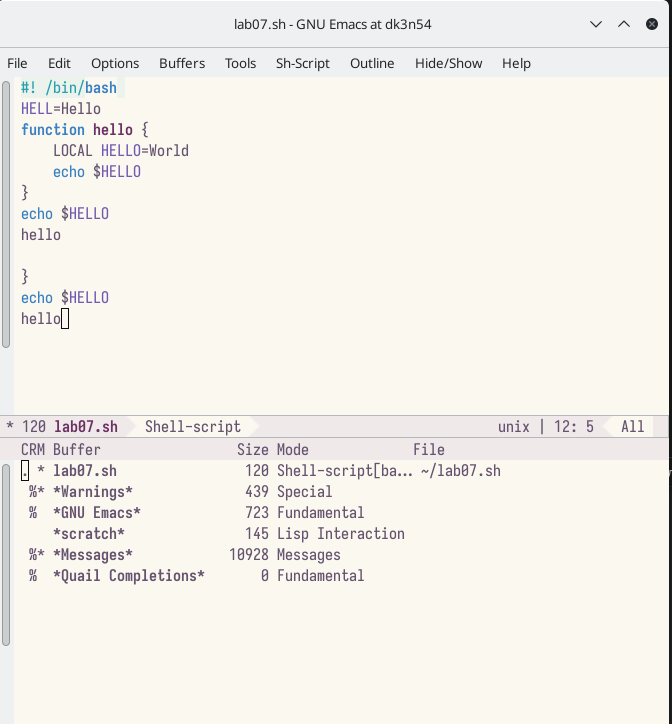{#fig:009 width=90%}

12.	Перемещаюсь во вновь открытое окно (C-x) со списком открытых буферов и переключитесь на другой буфер. 

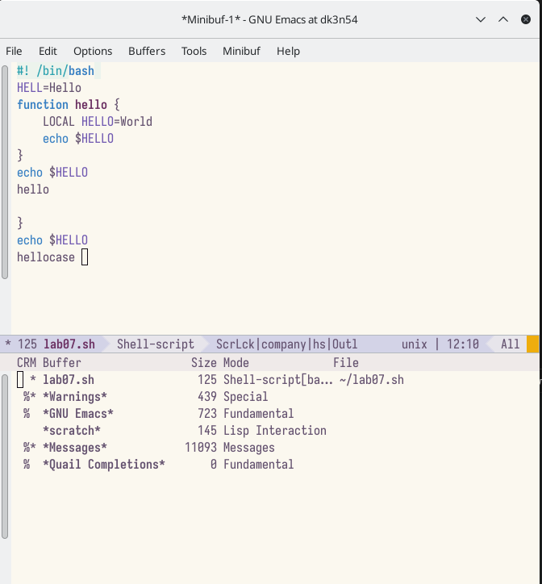{#fig:010 width=90%}

13.	Закрываю это окно(C-x 0); Теперь вновь переключаюсь между буферами, мо уже без вывода их списка на экран (C-x b).

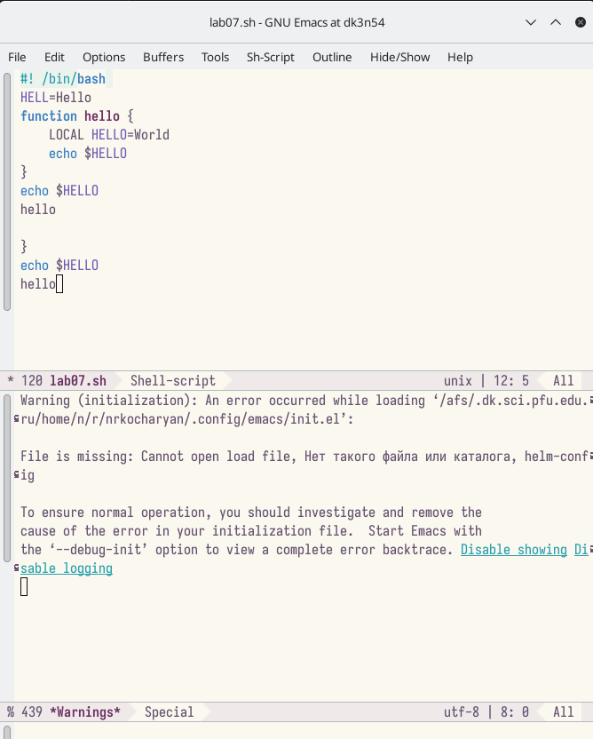{#fig:011 width=90%}

14.	Делю фрейм на 4 части: разделите фрейм на два окна по вертикали (C-x 3), а затем каждое из этих окон на две части по горизонтали (C-x 2); В каждом из четырёх созданных окон открываю новый буфер (файл) и ввожу несколько строк текста.

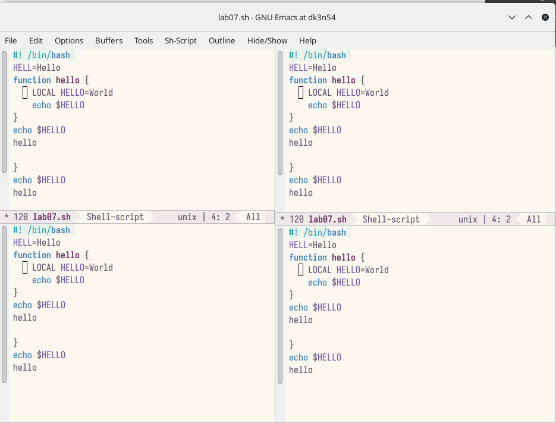{#fig:012 width=90%}

15.	Переключаюсь в режим поиска (C-s) и нахожу несколько слов, присутствующих в тексте.э

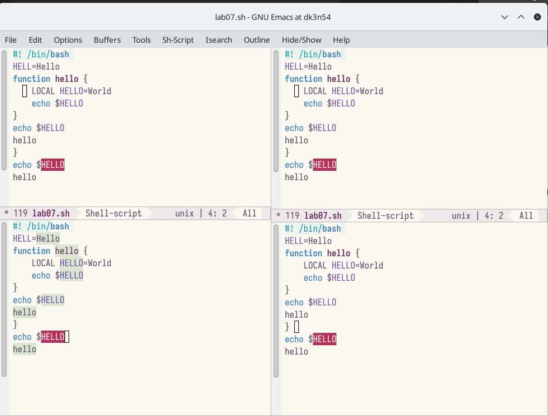{#fig:013 width=90%}

16.	Переключаюсь между результатами поиска, нажимая (C-s); выхожу из режима поиска, нажав C-g.

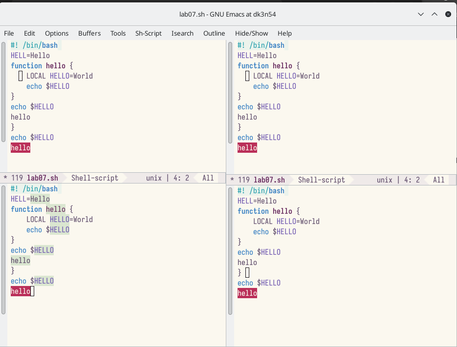{#fig:014 width=90%}

17.	Перехожу в режим поиска и замены (M-%), ввожу текст, который следует найти и заменить, нажимаю Enter , затем ввожу текст для замены. После того как будут подсвечены результаты поиска, нажимаю ! для подтверждения замены.

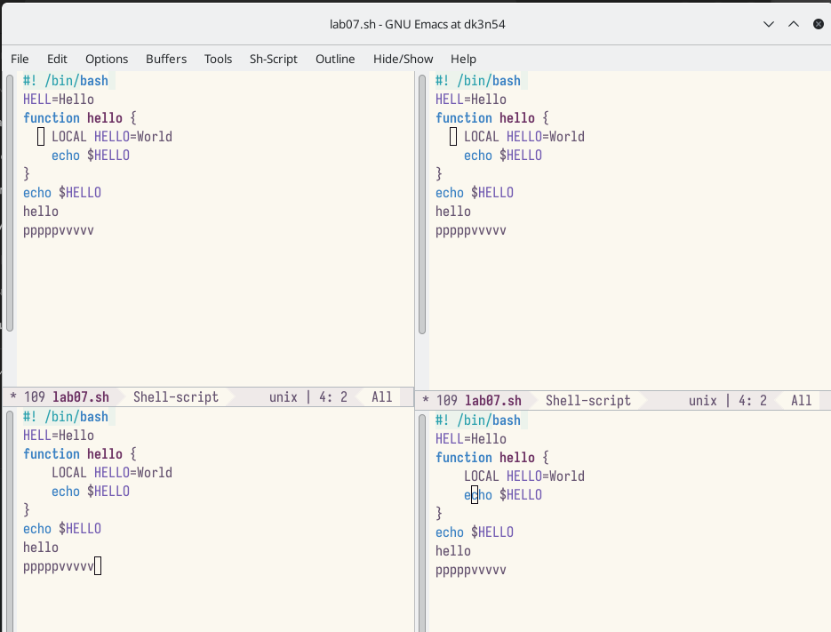{#fig:015 width=90%}

18.	Пробую другой режим поиска, нажав M-s o.

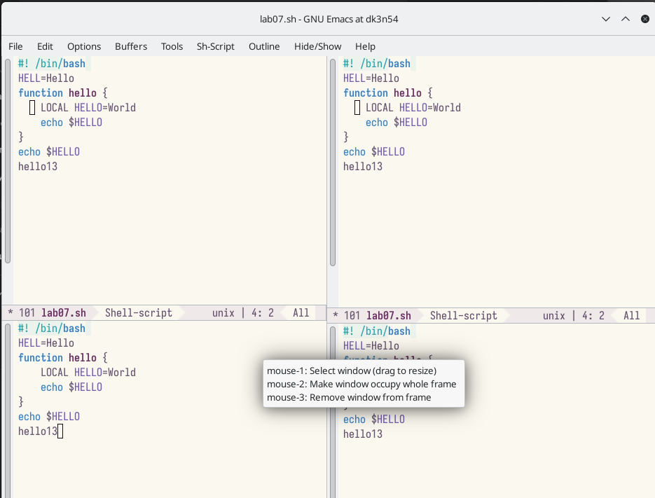{#fig:016 width=90%}

# Контрольные вопросы

1. Кратко охарактеризуйте редактор emacs.
2. Какие особенности данного редактора могут сделать его сложным для освоения но-
вичком?
3. Своими словами опишите, что такое буфер и окно в терминологии emacs’а.
4. Можно ли открыть больше 10 буферов в одном окне?
5. Какие буферы создаются по умолчанию при запуске emacs?
6. Какие клавиши вы нажмёте, чтобы ввести следующую комбинацию C-c | и C-c C-|?
7. Как поделить текущее окно на две части?
8. В каком файле хранятся настройки редактора emacs?
9. Какую функцию выполняет клавиша и можно ли её переназначить?
10. Какой редактор вам показался удобнее в работе vi или emacs? Поясните почему

# Выводы

В ходе выполнения лабораторной работы №9 я познакомился с операционной системой Linux. Получить практические навыки работы с редактором Emacs
