---
## Front matter
lang: ru-RU
title: Лабораторная работа № 10
subtitle: Программирование в командном процессоре ОС UNIX.Командные файлы.
author:
  - Кочарян Никита Робертович
institute:
  - Российский университет дружбы народов, Москва, Россия
date: 13 апреля 2023

## i18n babel
babel-lang: russian
babel-otherlangs: english

## Formatting pdf
toc: false
toc-title: Содержание
slide_level: 2
aspectratio: 169
section-titles: true
theme: metropolis
header-includes:
 - \metroset{progressbar=frametitle,sectionpage=progressbar,numbering=fraction}
 - '\makeatletter'
 - '\beamer@ignorenonframefalse'
 - '\makeatother'
---

# Информация

## Докладчик

:::::::::::::: {.columns align=center}
::: {.column width="70%"}

  * Кочарян Никита Робертович
  * Студент группы НБибд-04-22
  * Российский университет дружбы народов

:::
::: {.column width="30%"}

:::
::::::::::::::

## Цели и задачи

- Изучить основы программирования в оболочке ОС UNIX/Linux. Научиться писать небольшие командные файлы.

## Выполнение лабораторной работы

1.	Пишу скрипт, который при запуске будет делать резервную копию самого себя (тоесть файла, в котором содержится его исходный код) в другую директорию backup в моем домашнем каталоге. При этом файл должен архивироваться одним из архиваторов на выбор zip, bzip2 или tar. Способ использования команд архивации необходимо узнать, изучив справку.

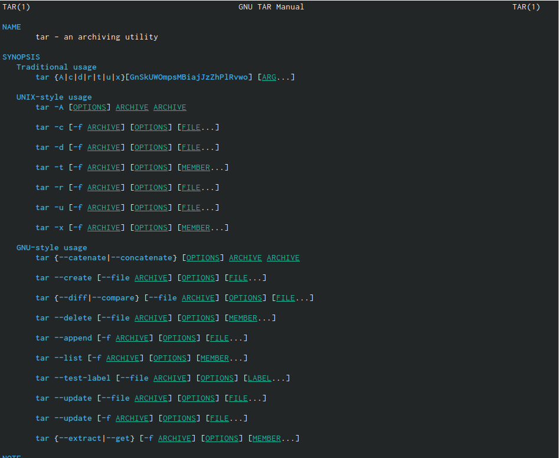{#fig:001 width=50%}
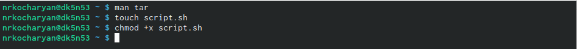{#fig:002 width=50%}

##

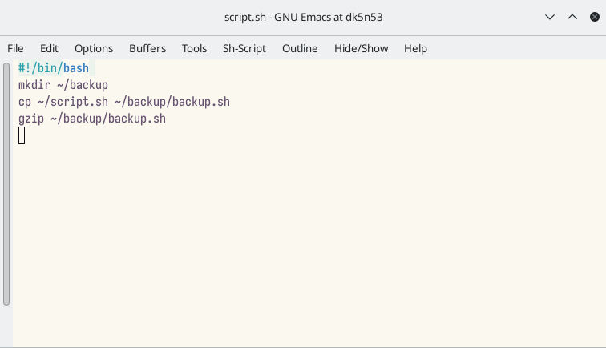{#fig:003 width=50%}
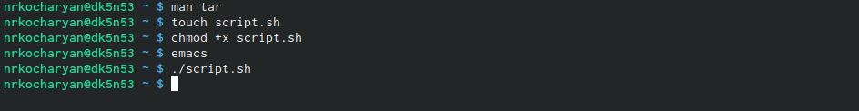{#fig:004 width=50%}

##

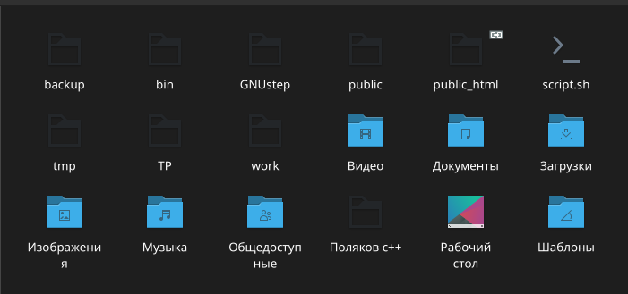{#fig:005 width=50%}
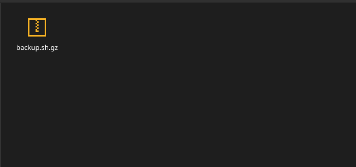{#fig:006 width=50%}

##

2.	Пишу пример командного файла, обрабатывающего любое произвольное числоаргументов командной строки, в том числе превышающее десять. Например, скрипт может последовательно распечатывать значения всех переданных аргументов.

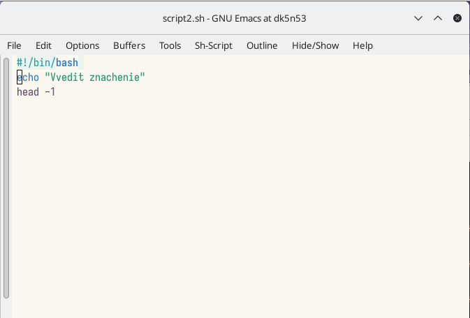{#fig:007 width=60%}
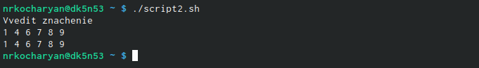{#fig:008 width=60%}

##

3.	Пишу командный файл — аналог команды ls (без использования самой этой команды и команды dir). Требуется, чтобы он выдавал информацию о нужном каталоге и выводил информацию о возможностях доступа к файлам этого каталога.

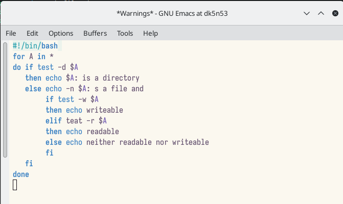{#fig:009 width=60%}
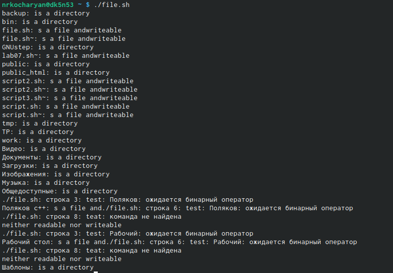{#fig:010 width=60%}

##

4.	Пишу командный файл, который получает в качестве аргумента командной строки формат файла (.txt, .doc, .jpg, .pdf и т.д.) и вычисляет количество таких файлов в указанной директории. Путь к директории также передаётся в виде аргумента командной строки

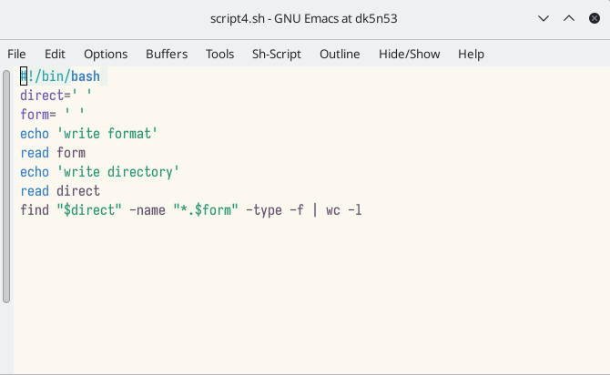{#fig:011 width=60%}
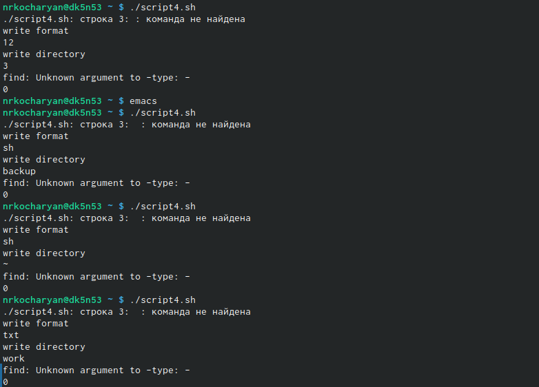{#fig:012 width=60%}

## Результаты

В ходе выполнения лабораторной работы №10 я изучил основы программирования в оболочке ОС UNIX/Linux. Научился писать небольшие командные файлы.
