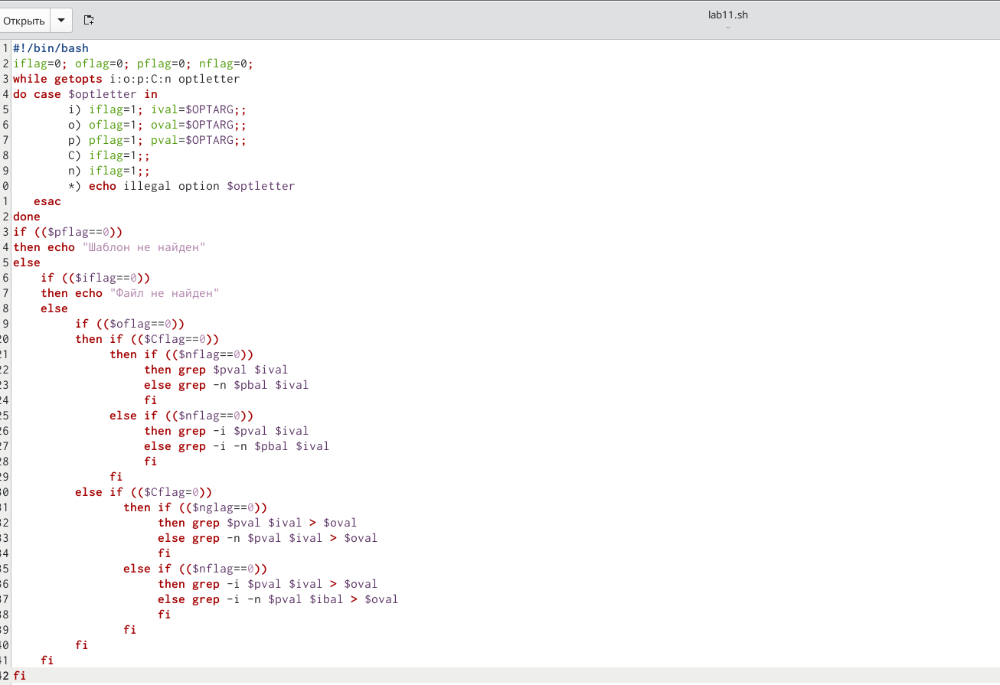
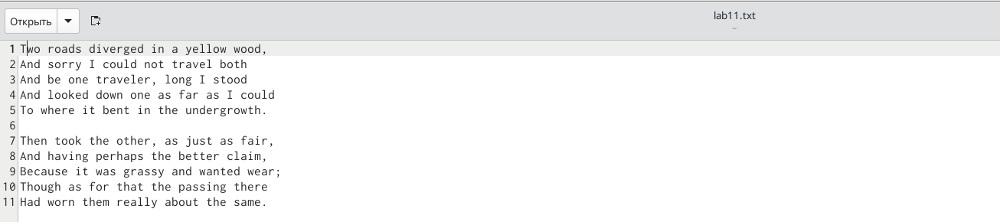
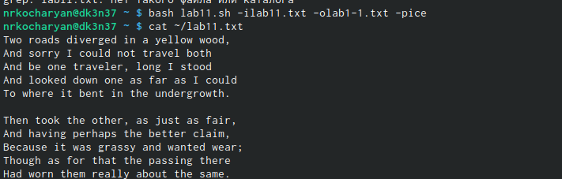
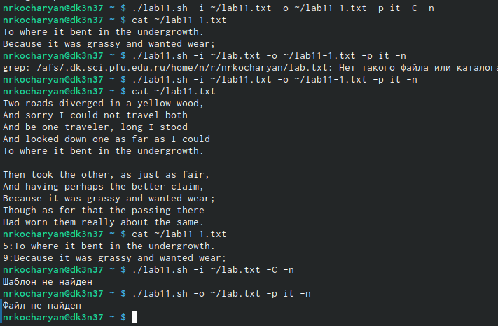
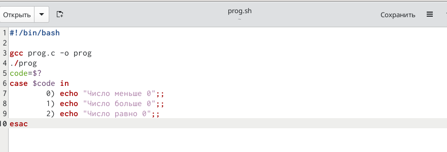
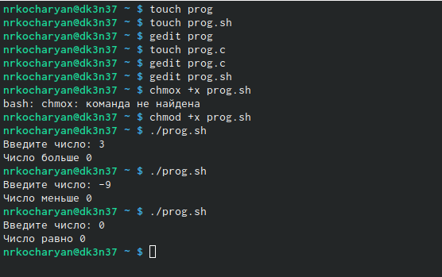
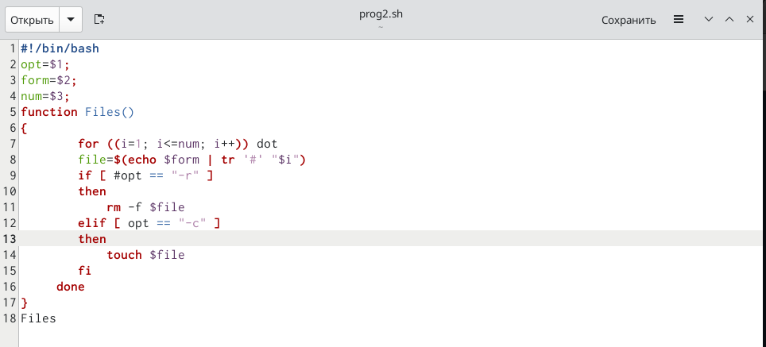
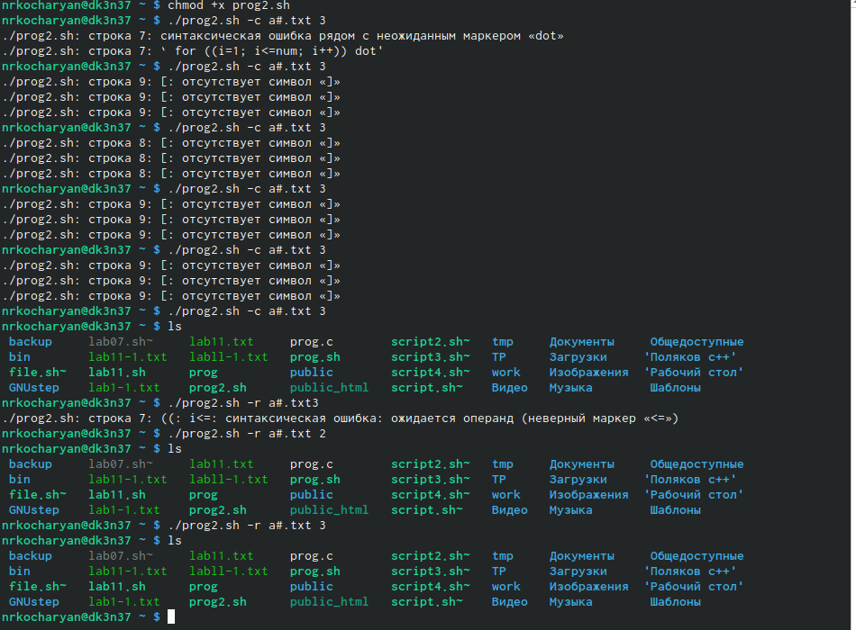
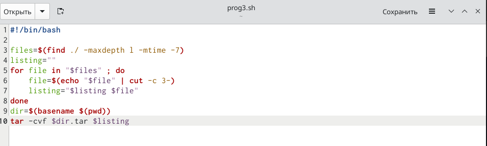
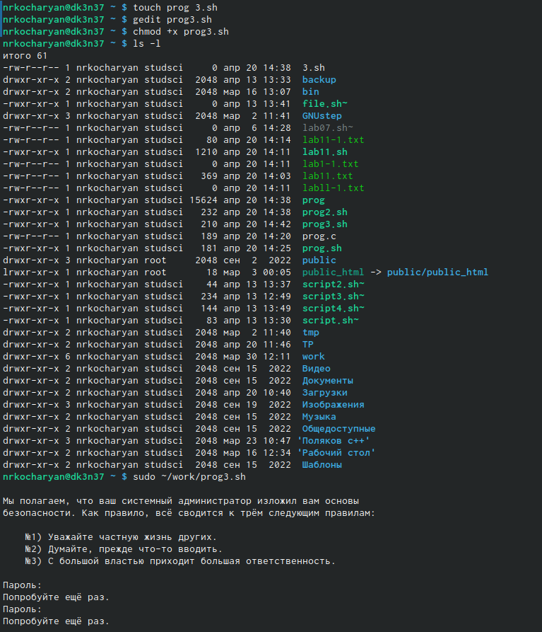

---
## Front matter
lang: ru-RU
title: Лабораторная работа № 11
subtitle: Программирование в командном процессоре ОС UNIX.Ветвления и циклы.
author:
  - Кочарян Никита Робертович
institute:
  - Российский университет дружбы народов, Москва, Россия
date: 21 апреля 2023

## i18n babel
babel-lang: russian
babel-otherlangs: english

## Formatting pdf
toc: false
toc-title: Содержание
slide_level: 2
aspectratio: 169
section-titles: true
theme: metropolis
header-includes:
 - \metroset{progressbar=frametitle,sectionpage=progressbar,numbering=fraction}
 - '\makeatletter'
 - '\beamer@ignorenonframefalse'
 - '\makeatother'
---

# Информация

## Докладчик

:::::::::::::: {.columns align=center}
::: {.column width="70%"}

  * Кочарян Никита Робертович
  * Студент группы НБибд-04-22
  * Российский университет дружбы народов

:::
::: {.column width="30%"}

:::
::::::::::::::

## Цели и задачи

- Изучить основы программирования в оболочке ОС UNIX/Linux. Научиться писать небольшие командные файлы.

## Выполнение лабораторной работы

1.	Используя команды getopts grep, пишу командный файл, который анализирует командную строку с ключами:
– -iinputfile — прочитать данные из указанного файла;
– -ooutputfile — вывести данные в указанный файл;
– -pшаблон — указать шаблон для поиска;
– -C — различать большие и малые буквы;
– -n — выдавать номера строк.

{#fig:001 width=60%}
{#fig:002 width=60%}

##

{#fig:003 width=60%}
{#fig:004 width=60%}

##

2.	Пишу на языке Си программу, которая вводит число и определяет, является ли оно больше нуля, меньше нуля или равно нулю. Затем программа завершается с помощью функции exit(n), передавая информацию в о коде завершения в оболочку. Командный файл должен вызывать эту программу и, проанализировав с помощью команды $?,выдать сообщение о том, какое число было введено.

{#fig:005 width=40%}
{#fig:006 width=40%}
{#fig:007 width=40%}

##

3.	Написать командный файл, создающий указанное число файлов, пронумерованных последовательно от 1 до 𝑁 (например 1.tmp, 2.tmp, 3.tmp,4.tmp и т.д.). Число файлов, которые необходимо создать, передаётся в аргументы командной строки. Этот же командный файл должен уметь удалять все созданные им файлы (если они существуют).

{#fig:008 width=60%}
{#fig:009 width=60%}

##

4.	Написать командный файл, который с помощью команды tar запаковывает в архив все файлы в указанной директории. Модифицировать его так, чтобы запаковывались только те файлы, которые были изменены менее недели тому назад (использовать команду find)

{#fig:010 width=60%}
{#fig:011 width=60%}

## Результаты

В ходе выполнения данной лабораторной работы я научился программировать в командом процессоре OC UNIX, узнал что такое ветвления и циклы.

