---
## Front matter
title: "Лабораторная работа №11.Программирование в командном процессоре ОС UNIX. Ветвления и циклы."
subtitle: "Операционые системы"
author: "Кочарян Никита Робертович"

## Generic otions
lang: ru-RU
toc-title: "Содержание"

## Bibliography
bibliography: bib/cite.bib
csl: pandoc/csl/gost-r-7-0-5-2008-numeric.csl

## Pdf output format
toc: true # Table of contents
toc-depth: 2
lof: true # List of figures
lot: true # List of tables
fontsize: 12pt
linestretch: 1.5
papersize: a4
documentclass: scrreprt
## I18n polyglossia
polyglossia-lang:
  name: russian
  options:
	- spelling=modern
	- babelshorthands=true
polyglossia-otherlangs:
  name: english
## I18n babel
babel-lang: russian
babel-otherlangs: english
## Fonts
mainfont: PT Serif
romanfont: PT Serif
sansfont: PT Sans
monofont: PT Mono
mainfontoptions: Ligatures=TeX
romanfontoptions: Ligatures=TeX
sansfontoptions: Ligatures=TeX,Scale=MatchLowercase
monofontoptions: Scale=MatchLowercase,Scale=0.9
## Biblatex
biblatex: true
biblio-style: "gost-numeric"
biblatexoptions:
  - parentracker=true
  - backend=biber
  - hyperref=auto
  - language=auto
  - autolang=other*
  - citestyle=gost-numeric
## Pandoc-crossref LaTeX customization
figureTitle: "Рис."
tableTitle: "Таблица"
listingTitle: "Листинг"
lofTitle: "Список иллюстраций"
lotTitle: "Список таблиц"
lolTitle: "Листинги"
## Misc options
indent: true
header-includes:
  - \usepackage{indentfirst}
  - \usepackage{float} # keep figures where there are in the text
  - \floatplacement{figure}{H} # keep figures where there are in the text
---

# Цель работы

Изучить основы программирования в оболочке ОС UNIX. Научится писать более сложные командные файлы с использованием логических управляющих конструкций и циклов.

# Задания

1. Используя команды getopts grep, написать командный файл, который анализирует
командную строку с ключами:
– -iinputfile — прочитать данные из указанного файла;
– -ooutputfile — вывести данные в указанный файл;
– -pшаблон — указать шаблон для поиска;
– -C — различать большие и малые буквы;
– -n — выдавать номера строк.
а затем ищет в указанном файле нужные строки, определяемые ключом -p.
2. Написать на языке Си программу, которая вводит число и определяет, является ли оно
больше нуля, меньше нуля или равно нулю. Затем программа завершается с помощью
функции exit(n), передавая информацию в о коде завершения в оболочку. Команд-
ный файл должен вызывать эту программу и, проанализировав с помощью команды
$?, выдать сообщение о том, какое число было введено.
3. Написать командный файл, создающий указанное число файлов, пронумерованных
последовательно от 1 до 𝑁 (например 1.tmp, 2.tmp, 3.tmp,4.tmp и т.д.). Число файлов,
которые необходимо создать, передаётся в аргументы командной строки. Этот же ко-
мандный файл должен уметь удалять все созданные им файлы (если они существуют).
4. Написать командный файл, который с помощью команды tar запаковывает в архив
все файлы в указанной директории. Модифицировать его так, чтобы запаковывались
только те файлы, которые были изменены менее недели тому назад (использовать
команду find).

# Выполнение лабораторной работы

1.	Используя команды getopts grep, пишу командный файл, который анализирует командную строку с ключами:
– -iinputfile — прочитать данные из указанного файла;
– -ooutputfile — вывести данные в указанный файл;
– -pшаблон — указать шаблон для поиска;
– -C — различать большие и малые буквы;
– -n — выдавать номера строк.

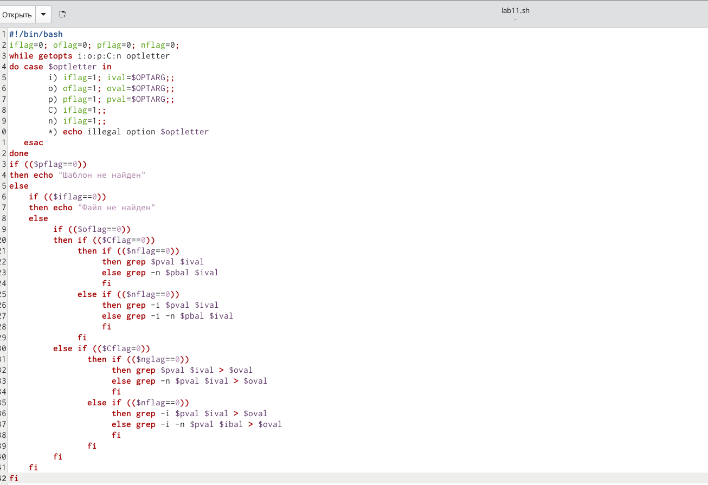{#fig:001 width=60%}
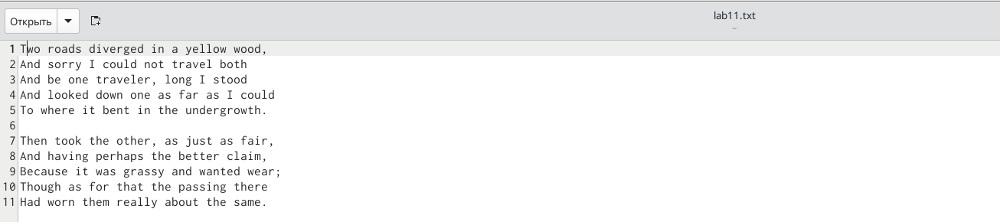{#fig:002 width=60%}
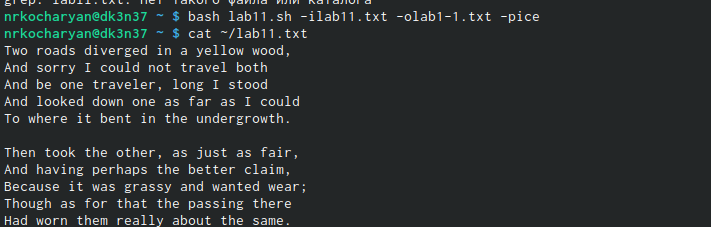{#fig:003 width=60%}
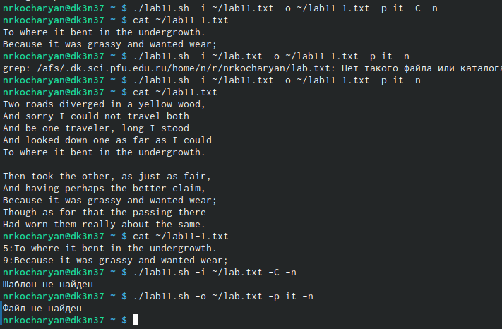{#fig:004 width=60%}

2.	Пишу на языке Си программу, которая вводит число и определяет, является ли оно больше нуля, меньше нуля или равно нулю. Затем программа завершается с помощью функции exit(n), передавая информацию в о коде завершения в оболочку. Командный файл должен вызывать эту программу и, проанализировав с помощью команды $?,выдать сообщение о том, какое число было введено.

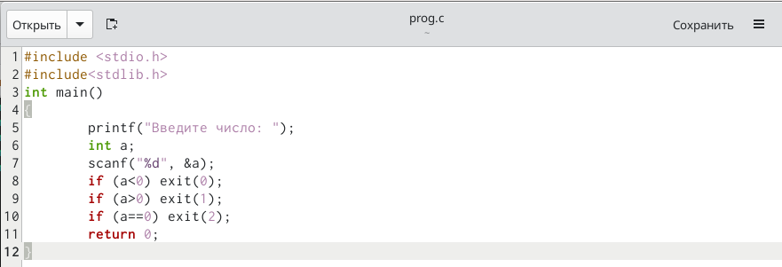{#fig:005 width=60%}
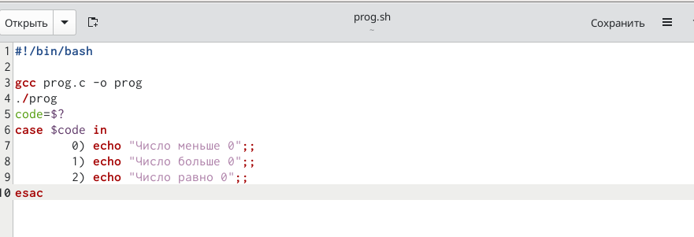{#fig:006 width=60%}
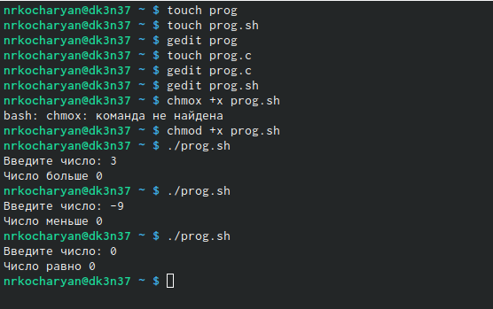{#fig:007 width=60%}

3.	Написать командный файл, создающий указанное число файлов, пронумерованных последовательно от 1 до 𝑁 (например 1.tmp, 2.tmp, 3.tmp,4.tmp и т.д.). Число файлов, которые необходимо создать, передаётся в аргументы командной строки. Этот же командный файл должен уметь удалять все созданные им файлы (если они существуют).

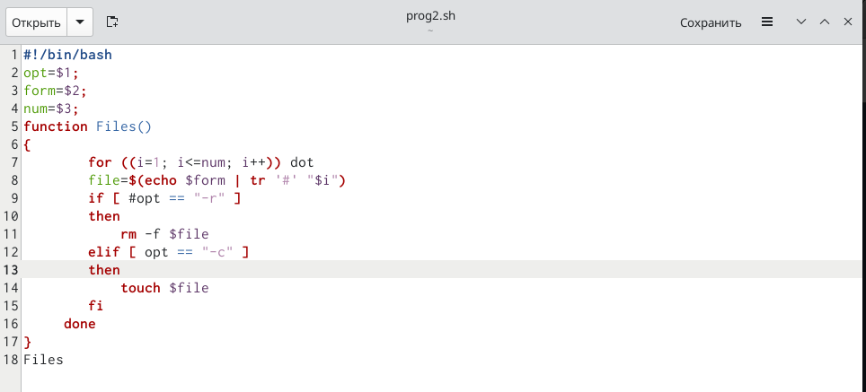{#fig:008 width=60%}
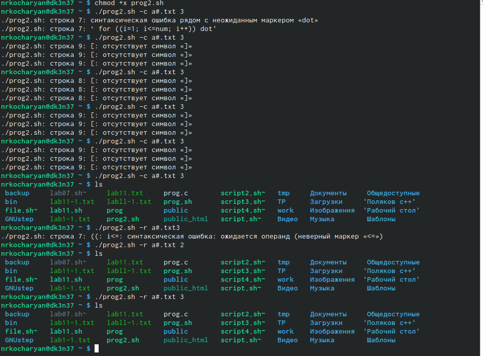{#fig:009 width=60%}

4.	Написать командный файл, который с помощью команды tar запаковывает в архив все файлы в указанной директории. Модифицировать его так, чтобы запаковывались только те файлы, которые были изменены менее недели тому назад (использовать команду find)

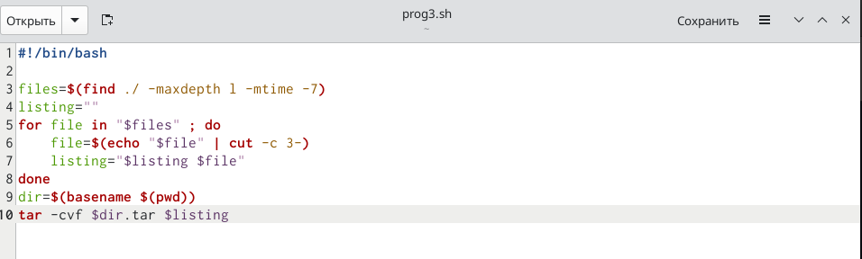{#fig:010 width=60%}
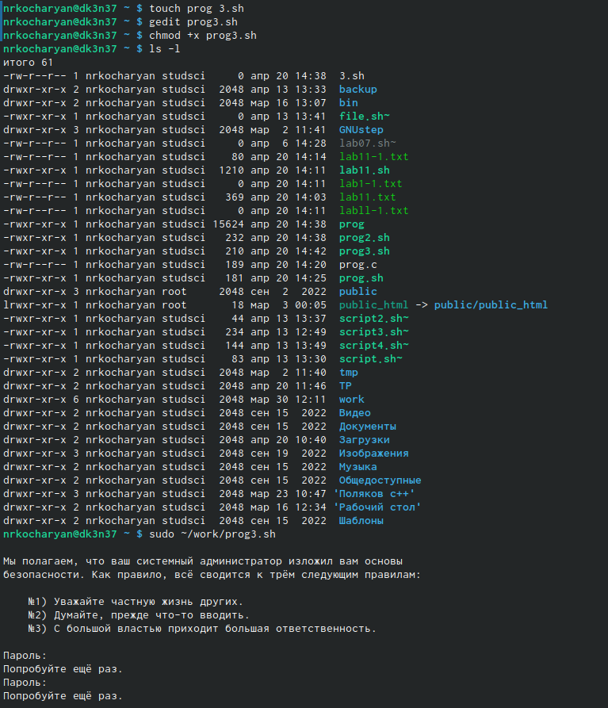{#fig:011 width=60%}

# Контрольные вопросы

1. Каково предназначение команды getopts?
2. Какое отношение метасимволы имеют к генерации имён файлов?
3. Какие операторы управления действиями вы знаете?
4. Какие операторы используются для прерывания цикла?
5. Для чего нужны команды false и true?
6. Что означает строка if test -f man$s/$i.$s, встреченная в командном файле?
7. Объясните различия между конструкциями while и until

# Ответы на контрольные вопросы

1.	Команда getopts является встроенной командой командной оболочки bash, предназначенной для разбора параметров сценариев. Она обрабатывает исключительно однобуквенные параметры как с аргументами, так и без них и этого вполне достаточно для передачи сценариям любых входных данных.
2.	 При генерации имен используют метасимволы:
 • произвольная (возможно пустая) последовательность символов; ? один произвольный символ; [...] любой из символов, указанных в скобках перечислением и/или с указанием диапазона; cat f* выдаст все файлы каталога, начинающиеся с "f"; cat f выдаст все файлы, содержащие "f"; cat program.? выдаст файлы данного каталога с однобуквенными расширениями, скажем "program.c" и "program.o", но не выдаст "program.com"; cat [a-d]* выдаст файлы, которые начинаются с "a", "b", "c", "d". Аналогичный эффект дадут и команды "cat [abcd]" и "cat [bdac]".
3.	 Операторы && и  являются управляющими операторами. Если в командной строке стоит command1 && command2, то command2 выполняется в том, и только в том случае, если статус выхода из команды command1 равен нулю, что говорит об успешном ее завершении. Аналогично, если командная строка имеет вид command1  command2, то команда command2 выполняется тогда, и только тогда, когда статус выхода из команды command1 отличен от нуля.
4.	 Оператор break завершает выполнение ближайшего включающего цикла или условного оператора, в котором он отображается.
5.	 Команда true всегда возвращает ноль в качестве выходного статуса для индикации успеха. Команда false всегда возвращает не-ноль в качестве выходного статуса для индикации неудачи. Во всех управляющих конструкциях в качестве логического значения используется код возврата из программы, указанной в качестве условия. Код возврата 0 – истина, любое другое значение – ложь. Программа true – всегда завершается с кодом 0, false – всегда завершается с кодом 1.
6.	 Введенная строка означает условие существования файла man$s/$i.$s
7.	 Цикл While выполняется до тех пор, пока указанное в нем условие истинно. Когда указанное условие становится ложным - цикл завершается. Цикл Until выполняется до тех пор, пока указанное в нем условие ложно.

# Вывод

В ходе выполнения данной лабораторной работы я научился программировать в командом процессоре OC UNIX, узнал что такое ветвления и циклы.

