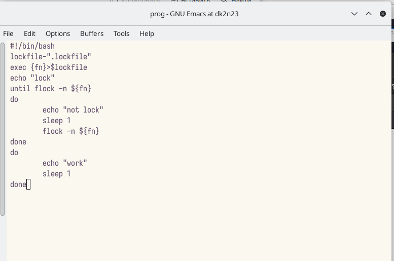
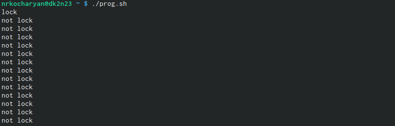
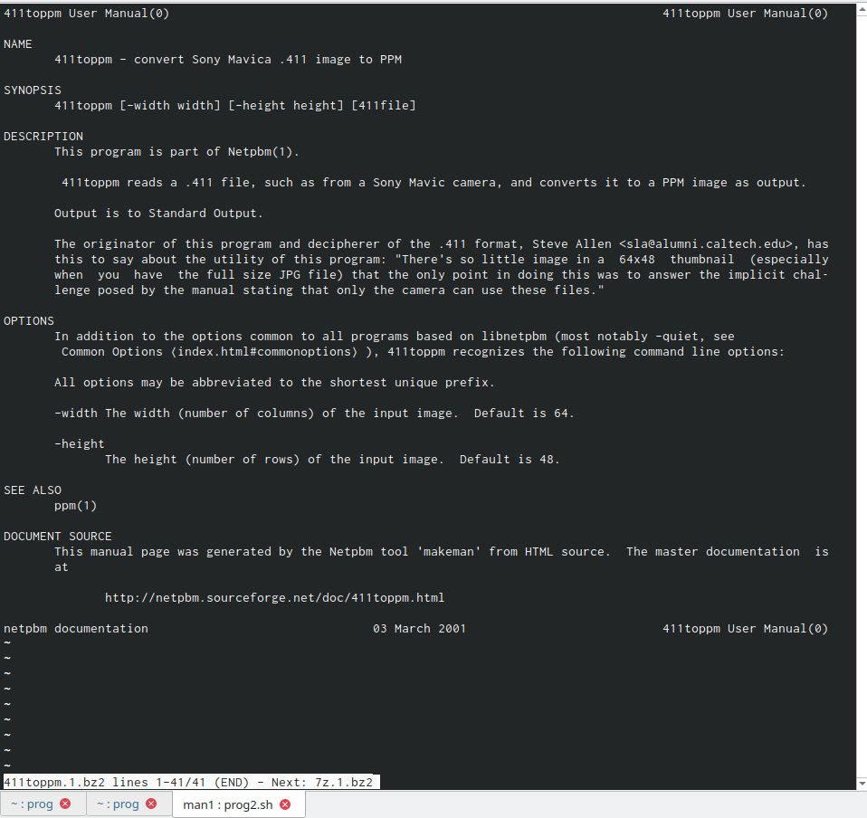
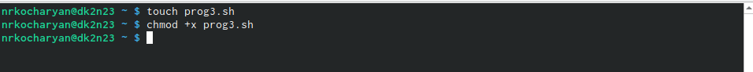
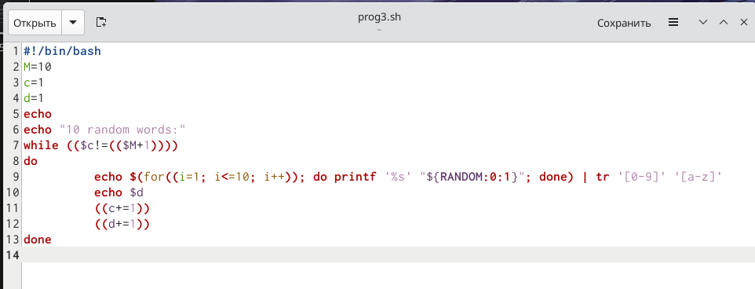
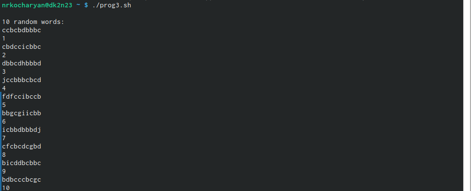

---
## Front matter
title: "Лабораторная работа №12.Программирование в командном процессоре ОС UNIX. Расширенное программирование."
subtitle: "Операционые системы"
author: "Кочарян Никита Робертович"

## Generic otions
lang: ru-RU
toc-title: "Содержание"

## Bibliography
bibliography: bib/cite.bib
csl: pandoc/csl/gost-r-7-0-5-2008-numeric.csl

## Pdf output format
toc: true # Table of contents
toc-depth: 2
lof: true # List of figures
lot: true # List of tables
fontsize: 12pt
linestretch: 1.5
papersize: a4
documentclass: scrreprt
## I18n polyglossia
polyglossia-lang:
  name: russian
  options:
	- spelling=modern
	- babelshorthands=true
polyglossia-otherlangs:
  name: english
## I18n babel
babel-lang: russian
babel-otherlangs: english
## Fonts
mainfont: PT Serif
romanfont: PT Serif
sansfont: PT Sans
monofont: PT Mono
mainfontoptions: Ligatures=TeX
romanfontoptions: Ligatures=TeX
sansfontoptions: Ligatures=TeX,Scale=MatchLowercase
monofontoptions: Scale=MatchLowercase,Scale=0.9
## Biblatex
biblatex: true
biblio-style: "gost-numeric"
biblatexoptions:
  - parentracker=true
  - backend=biber
  - hyperref=auto
  - language=auto
  - autolang=other*
  - citestyle=gost-numeric
## Pandoc-crossref LaTeX customization
figureTitle: "Рис."
tableTitle: "Таблица"
listingTitle: "Листинг"
lofTitle: "Список иллюстраций"
lotTitle: "Список таблиц"
lolTitle: "Листинги"
## Misc options
indent: true
header-includes:
  - \usepackage{indentfirst}
  - \usepackage{float} # keep figures where there are in the text
  - \floatplacement{figure}{H} # keep figures where there are in the text
---

# Цель работы

Изучить основы программирования в оболочке ОС UNIX. Научится писать более сложные командные файлы с использованием логических управляющих конструкций и циклов.

# Задания

1.	Написать командный файл, реализующий упрощённый механизм семафоров. Ко-
мандный файл должен в течение некоторого времени t1 дожидаться освобождения
ресурса, выдавая об этом сообщение, а дождавшись его освобождения, использовать
его в течение некоторого времени t2<>t1, также выдавая информацию о том, что
ресурс используется соответствующим командным файлом (процессом). Запустить
командный файл в одном виртуальном терминале в фоновом режиме, перенаправив
его вывод в другой (> /dev/tty#, где # — номер терминала куда перенаправляется
вывод), в котором также запущен этот файл, но не фоновом, а в привилегированном
режиме. Доработать программу так, чтобы имелась возможность взаимодействия трёх
и более процессов.
2.	Реализовать команду man с помощью командного файла. Изучите содержимое ката-
лога /usr/share/man/man1. В нем находятся архивы текстовых файлов, содержащих
справку по большинству установленных в системе программ и команд. Каждый архив
можно открыть командой less сразу же просмотрев содержимое справки. Командный
файл должен получать в виде аргумента командной строки название команды и в виде
результата выдавать справку об этой команде или сообщение об отсутствии справки,
если соответствующего файла нет в каталоге man1.
3.	Используя встроенную переменную $RANDOM, напишите командный файл, генерирую-
щий случайную последовательность букв латинского алфавита. Учтите, что $RANDOM
выдаёт псевдослучайные числа в диапазоне от 0 до 32767.

# Выполнение лабораторной работы

1.	Пишу командный файл, реализующий упрощённый механизм семафоров. Командный файл должен в течение некоторого времени t1 дожидаться освобождения ресурса, выдавая об этом сообщение, а дождавшись его освобождения, использовать его в течение некоторого времени t2<>t1, также выдавая информацию о том, что ресурс используется соответствующим командным файлом (процессом). Запустить командный файл в одном виртуальном терминале в фоновом режиме, перенаправив его вывод в другой (> /dev/tty#, где # — номер терминала куда перенаправляется вывод), в котором также запущен этот файл, но не фоновом, а в привилегированном режиме. Дорабатываю программу так, чтобы имелась возможность взаимодействия трёх и более процессов

{#fig:001 width=80%}

{#fig:002 width=80%}

{#fig:003 width=80%}

2.	Реализовать команду man с помощью командного файла. Изучите содержимое каталога /usr/share/man/man1. В нем находятся архивы текстовых файлов, содержащих справку по большинству установленных в системе программ и команд. Каждый архив можно открыть командой less сразу же просмотрев содержимое справки. Командный файл должен получать в виде аргумента командной строки название команды и в виде результата выдавать справку об этой команде или сообщение об отсутствии справки,если соответствующего файла нет в каталоге man1.

{#fig:004 width=80%}

{#fig:005 width=80%}

3.	Используя встроенную переменную $RANDOM, напишите командный файл, генерирующий случайную последовательность букв латинского алфавита. Учтите, что $RANDOM выдаёт псевдослучайные числа в диапазоне от 0 до 32767.

{#fig:006 width=80%}

{#fig:007 width=80%}

{#fig:008 width=80%}

# Контрольные вопросы

1.	Найдите синтаксическую ошибку в следующей строке
	
	while [$1 != "exit"]

2. Как объединить (конкатенация) несколько строк в одну?
3. Найдите информацию об утилите seq. Какими иными способами можно реализовать
её функционал при программировании на bash?
4. Какой результат даст вычисление выражения $((10/3))?
5. Укажите кратко основные отличия командной оболочки zsh от bash.
6. Проверьте, верен ли синтаксис данной конструкции
	
	for ((a=1; a <= LIMIT; a++))

7. Сравните язык bash с какими-либо языками программирования. Какие преимущества
у bash по сравнению с ними? Какие недостатки?
	
# Ответы на контрольные вопросы

1.	В строке while [$1 != "exit"] квадратные скобки надо заменить на круглые.

2.    Есть несколько видов конкатенации строк. Например, VAR1="Hello," VAR2=" World" VAR3="$VAR1$VAR2" echo "$VAR3"

3.    Команда seq выводит последовательность целых или действительных чисел, подходящую для передачи в другие программы. В bash можно использовать seq с циклом for, используя подстановку команд. Например, $ for i in $(seq 1 0.5 4) do echo "The number is $i" done

4.    Результатом вычисления выражения $((10/3)) будет число 3.

5.    Список того, что можно получить, используя Z Shell вместо Bash: Встроенная команда zmv поможет массово переименовать файлы/директории, например, чтобы добавить ‘.txt’ к имени каждого файла, запустите zmv –C '(*)(#q.)' '$1.txt'. Утилита zcalc — это замечательный калькулятор командной строки, удобный способ считать быстро, не покидая терминал. Команда zparseopts — это однострочник, который поможет разобрать сложные варианты, которые предоставляются скрипту. Команда autopushd позволяет делать popd после того, как с помощью cd, чтобы вернуться в предыдущую директорию. Поддержка чисел с плавающей точкой (коей Bash не содержит). Поддержка для структур данных «хэш». Есть также ряд особенностей, которые присутствуют только в Bash: Опция командной строки –norc, которая позволяет пользователю иметь дело с инициализацией командной строки, не читая файл .bashrc Использование опции –rcfile с bash позволяет исполнять команды из определённого файла. Отличные возможности вызова (набор опций для командной строки) Может быть вызвана командой sh Bash можно запустить в определённом режиме POSIX. Примените set –o posix, чтобы включить режим, или ––posix при запуске. Можно управлять видом командной строки в Bash. Настройка переменной PROMPT_COMMAND с одним или более специальными символами настроит её за вас. Bash также можно включить в режиме ограниченной оболочки (с rbash или --restricted), это означает, что некоторые команды/действия больше не будут доступны: Настройка и удаление значений служебных переменных SHELL, PATH, ENV, BASH_ENV Перенаправление вывода с использованием операторов ‘>’, ‘>|’, ‘<>’, ‘>&’, ‘&>’, ‘>>’ Разбор значений SHELLOPTS из окружения оболочки при запуске Использование встроенного оператора exec, чтобы заменить оболочку другой командой

6.    Синтаксис конструкции for ((a=1; a <= LIMIT; a++)) верен.

7.   Язык bash и другие языки программирования: -Скорость работы программ на ассемблере может быть более 50% медленнее, чем программ на си/си++, скомпилированных с максимальной оптимизацией; -Скорость работы виртуальной ява-машины с байт-кодом часто превосходит скорость аппаратуры с кодами, получаемыми трансляторами с языков высокого уровня. Ява-машина уступает по скорости только ассемблеру и лучшим оптимизирующим трансляторам; -Скорость компиляции и исполнения программ на яваскрипт в популярных браузерах лишь в 2-3 раза уступает лучшим трансляторам и превосходит даже некоторые качественные компиляторы, безусловно намного (более чем в 10 раз) обгоняя большинство трансляторов других языков сценариев и подобных им по скорости исполнения программ; -Скорость кодов, генерируемых компилятором языка си фирмы Intel, оказалась заметно меньшей, чем компилятора GNU и иногда LLVM; -Скорость ассемблерных кодов x86-64 может меньше, чем аналогичных кодов x86, примерно на 10%; -Оптимизация кодов лучше работает на процессоре Intel; -Скорость исполнения на процессоре Intel была почти всегда выше, за исключением языков лисп, эрланг, аук (gawk, mawk) и бэш. Разница в скорости по бэш скорее всего вызвана разными настройками окружения на тестируемых системах, а не собственно транслятором или железом. Преимущество Intel особенно заметно на 32-разрядных кодах; -Стек большинства тестируемых языков, в частности, ява и яваскрипт, поддерживают только очень ограниченное число рекурсивных вызовов. Некоторые трансляторы (gcc, icc, ...) позволяют увеличить размер стека изменением переменных среды исполнения или параметром; -В рассматриваемых версиях gawk, php, perl, bash реализован динамический стек, позволяющий использовать всю память компьютера. Но perl и, особенно, bash используют стек настолько экстенсивно, что 8-16 ГБ не хватает для расчета ack(5,2,3)

# Вывод

В ходе выполнения данной лабораторной работы я научился рассширенному программированию в командом процессоре OC UNIX,.
