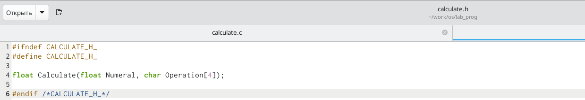

---
## Front matter
lang: ru-RU
title: Лабораторная работа №13.Средства, применяемые при разработке программного обеспечения в ОС типа UNIX/Linux."
subtitle: Операционные системы
author:
  - Кочарян Никита Робертович.
institute:
  - Российский Университет Дружбы Народов, Москва, Россия
date: 4 мая 2023

## i18n babel
babel-lang: russian
babel-otherlangs: english

## Formatting pdf
toc: false
toc-title: Содержание
slide_level: 2
aspectratio: 169
section-titles: true
theme: metropolis
header-includes:
 - \metroset{progressbar=frametitle,sectionpage=progressbar,numbering=fraction}
 - '\makeatletter'
 - '\beamer@ignorenonframefalse'
 - '\makeatother'
---

# Информация

## Докладчик

:::::::::::::: {.columns align=center}
::: {.column width="70%"}

  * Кочарян Никита робертович
  * студент Российского Универстите Дружбы Народов
  * Российский университет дружбы народов

:::
::: {.column width="30%"}

:::
::::::::::::::

## Цели и задачи

Приобрести простейшие навыки разработки, анализа, тестирования и отладки приложений в ОС типа UNIXLinux на примере создания на языке программирования С калькулятора с простейшими функциями.

# Выполнение лабораторной работы

1.	В домашнем каталог создал подкаталог ~/work/os/lab_prog.

{#fig:001 width=80%}

##

2.	Создаю в нем файлы calculate.h, calculate.c,main.c. Это будет примитивнейший калькулятор, способный складывать, вычитать, умножать и делить, возводить число в степень, брать квадратный корень, вычислять sin, cos, tan. При запуске он будет запрашивать первое число, операцию, второе число. После этого программа выведет результат и остановится.

{#fig:002 width=80%}

##

3.	Реализация функций калькулятора в файле calculate.h.

{#fig:003 width=50%}

{#fig:004 width=50%}

##

4.	Реализация интерфейсного файла calculate.h, описывающий формат вызова функции-калькулятор

{#fig:005 width=80%}

##

5.	Реализация основного файла main.c, реализующая интерфейс пользователя к калькулятору

{#fig:006 width=80%}

##

6.	Выполняю компиляцию програмы посредством gcc

{#fig:007 width=50%}

{#fig:008 width=50%}

##

7.	Исправил синтаксические ошибки

##

8.	Создаю Makefile 

{#fig:009 width=80%}

##

9.	С помощью gdb выполняю отладку программы calcul (перед использованием gdb исправляю Makefile): Запускаю отладчик GDB, загрузив в него программу для отладки gdb ./calcul

{#fig:010 width=50%}

{#fig:011 width=50%}

## Результаты

В ходе выполнения данной лабораторной работы я приобрел простейшие навыки разработки, анализа, тестирования отладки приложений в ОС типа UNIX/Linux на примере создания на языке программирования C калькулятора с простейшими функциями

