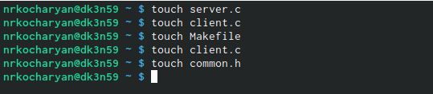
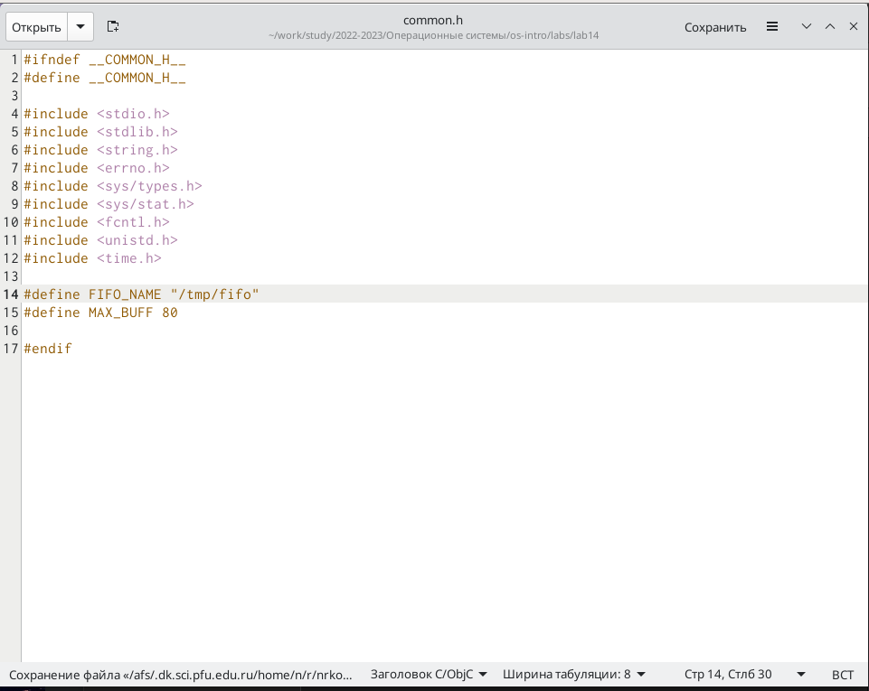
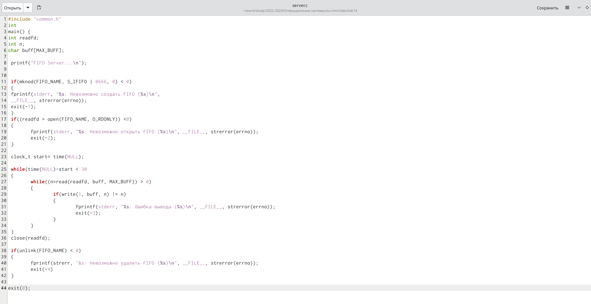
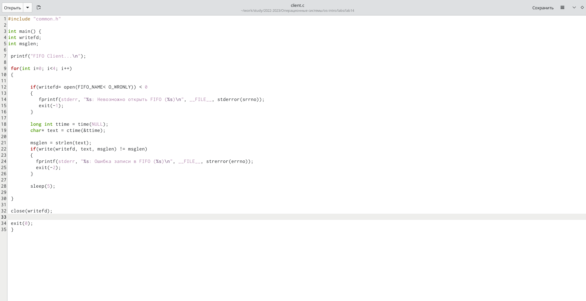
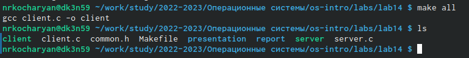
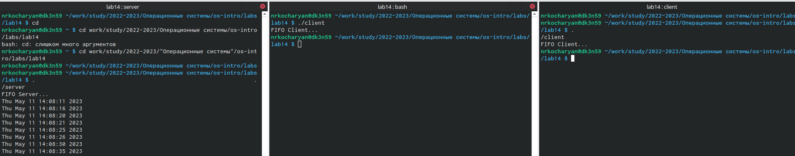

---
## Front matter
lang: ru-RU
title: Лабораторная работа №14.Именованные каналы.
subtitle: Операционные системы
author:
  - Кочарян Никита Робертович.
institute:
  - Российский Университет Дружбы Народов, Москва, Россия
date: 11 мая 2023

## i18n babel
babel-lang: russian
babel-otherlangs: english

## Formatting pdf
toc: false
toc-title: Содержание
slide_level: 2
aspectratio: 169
section-titles: true
theme: metropolis
header-includes:
 - \metroset{progressbar=frametitle,sectionpage=progressbar,numbering=fraction}
 - '\makeatletter'
 - '\beamer@ignorenonframefalse'
 - '\makeatother'
---

# Информация

## Докладчик

:::::::::::::: {.columns align=center}
::: {.column width="70%"}

  * Кочарян Никита робертович
  * студент Российского Универстите Дружбы Народов
  * Российский университет дружбы народов

:::
::: {.column width="30%"}

:::
::::::::::::::

## Цели и задачи

Приобретение практических навыков работы с именованными каналами

# Выполнение лабораторной работы

1.	Создаю файлы common.h ; server.c ; client.c ; Makefile.

{#fig:001 width=80%}

##

2.	Изменяю Код программ предоставленых в тексте лабораторной работы.

{#fig:002 width=80%}

##

{#fig:003 width=50%}

##

{#fig:004 width=80%}

##

3.	После редактирования файлов, я, используя команду make all скомпилировал все небходимые файлы

{#fig:005 width=80%}

##

4.	Проверяю работу написанного мною кода. Открыл 3 консоли и запустил в первом терминале - ./server, а в остальных ./client. В результате каждый терминал-клиент вывел по 4 сообщения. Спустя 30 секунд работа сервера была прекращена. 

{#fig:006 width=80%}

## Результаты

В ходе выполнения данной лабораторной работы я приобрел практические навыки работы с именованными каналами.
