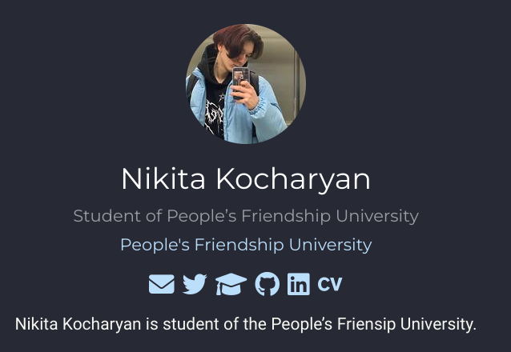
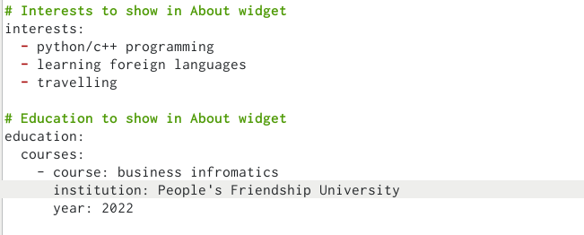
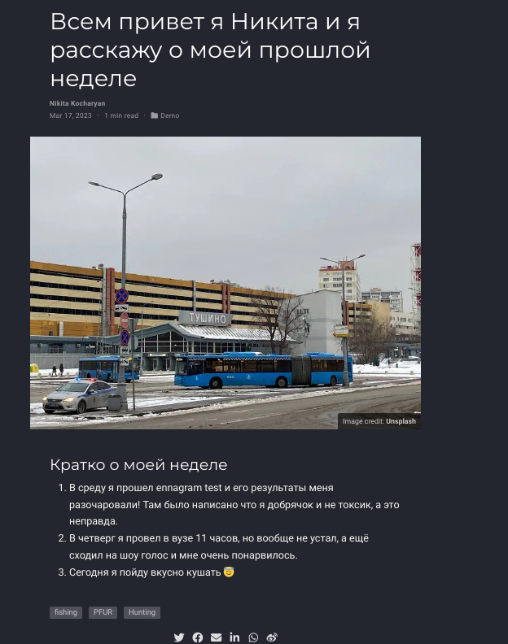
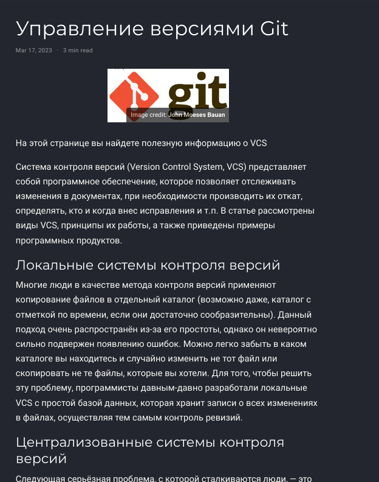
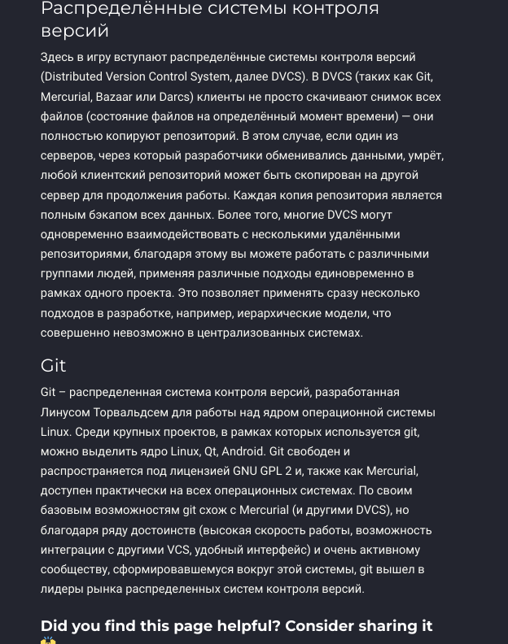

---
## Front matter
lang: ru-RU
title: Индивидуальный проект этап 2
subtitle: Операционнные системы
author:
  - Кочарян Никита Робертович
institute:
  - Российский университет дружбы народов, Москва, Россия
date: 17 марта 2023

## i18n babel
babel-lang: russian
babel-otherlangs: english

## Formatting pdf
toc: false
toc-title: Содержание
slide_level: 2
aspectratio: 169
section-titles: true
theme: metropolis
header-includes:
 - \metroset{progressbar=frametitle,sectionpage=progressbar,numbering=fraction}
 - '\makeatletter'
 - '\beamer@ignorenonframefalse'
 - '\makeatother'
---

# Информация

## Докладчик

:::::::::::::: {.columns align=center}
::: {.column width="70%"}

  * Кочарян Никита Робертович
  * Студент группы НБибд-04-22
  * Российский университет дружбы народов


:::
::: {.column width="30%"}

:::
::::::::::::::

## Цели и задачи

- Добавить к сайту данные о себе.

## Выполнение лабораторной работы

1.	С помощью редактирования файла avatar.jpg, находящимся в директории ~/work/study/blog/content/authors/admin меняю фото на свое; редактируя файл index в той же директории меняю краткое описание владельца сайта

{#fig:001 width=90%}

##

2.	Редактируя тот же файл index добавляю информацию об интересах и образовании

{#fig:002 width=90%}

##

3.	Редактируя файл index в директории ~/work/study/blog/content/post/getting-started создаю пост о своей прошедшей неделе

{#fig:003 width=90%}

##

4.	Редактируя файл index в директории ~/work/study/blog/content/post/writing technical content создаю пост об управлении версиями Git.

{#fig:004 width=50%}

{#fig:005 width=50%}

## Формат `pdf`

- Использование LaTeX
- Пакет для презентации: [beamer](https://ctan.org/pkg/beamer)
- Тема оформления: `metropolis`

## Код для формата `pdf`

```yaml
slide_level: 2
aspectratio: 169
section-titles: true
theme: metropolis
```

## Формат `html`

- Используется фреймворк [reveal.js](https://revealjs.com/)
- Используется [тема](https://revealjs.com/themes/) `beige`

## Код для формата `html`

- Тема задаётся в файле `Makefile`

```make
REVEALJS_THEME = beige 
```

## Результаты

Благодаря данной лабораторной работе я научился редактировать сайт, добавлять посты и вставлять в них картинки.

