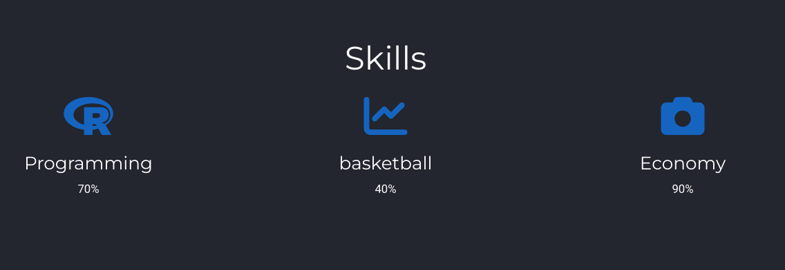
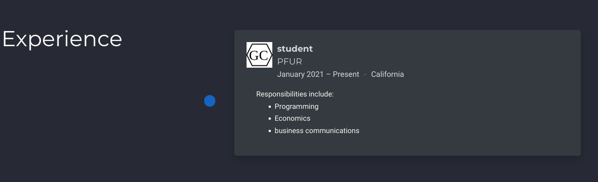
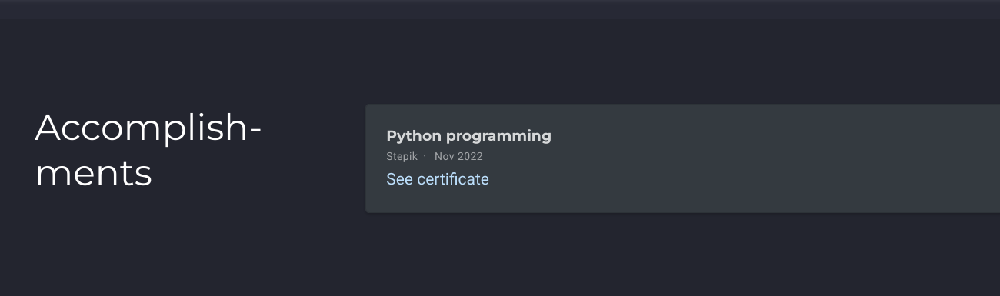
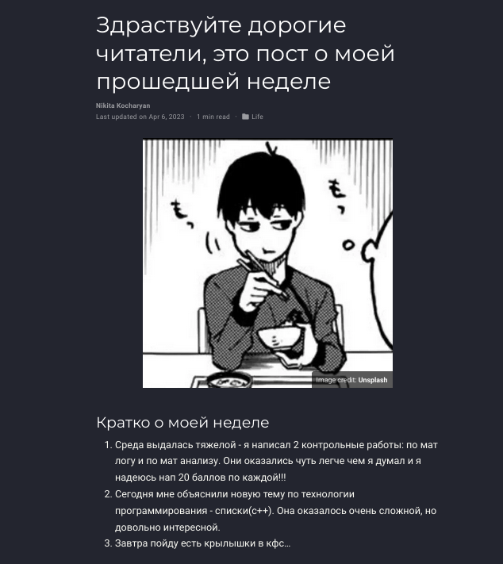
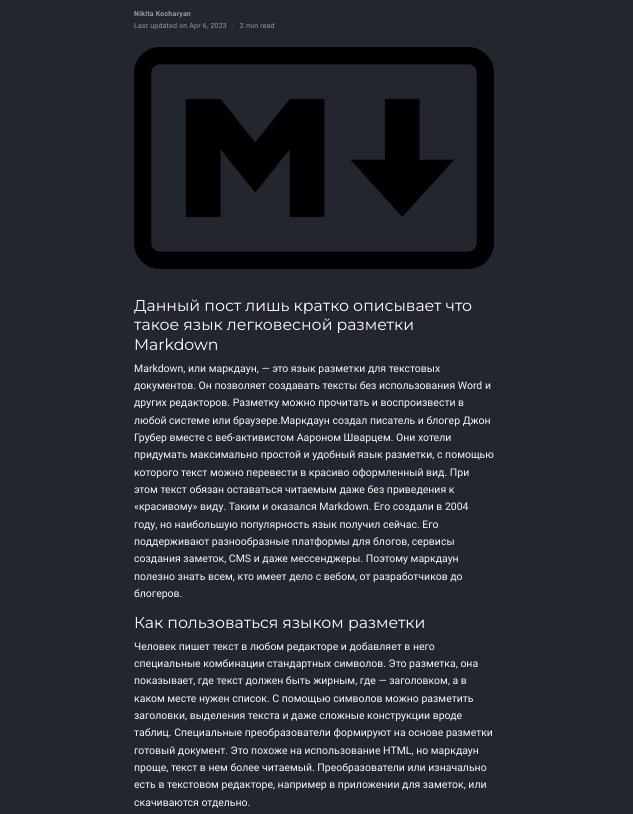
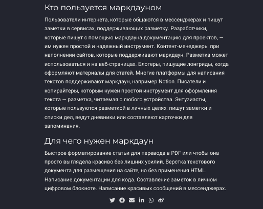

---
## Front matter
lang: ru-RU
title: Индивидуальный проект
subtitle: 3 этап
author:
  - Кочарян Никита Робертович
institute:
  - Российский университет дружбы народов, Москва, Россия
date: 6 апреля 2023

## i18n babel
babel-lang: russian
babel-otherlangs: english

## Formatting pdf
toc: false
toc-title: Содержание
slide_level: 2
aspectratio: 169
section-titles: true
theme: metropolis
header-includes:
 - \metroset{progressbar=frametitle,sectionpage=progressbar,numbering=fraction}
 - '\makeatletter'
 - '\beamer@ignorenonframefalse'
 - '\makeatother'
---

# Информация

## Докладчик

:::::::::::::: {.columns align=center}
::: {.column width="70%"}

  * Кочарян Никита Робертович
  * Студент группы НБибд-04-22
  * Российский университет дружбы народов

:::
::: {.column width="30%"}

:::
::::::::::::::

## Цели и задачи

Добавить к сайту достижения.

Список достижений.
	Добавить информацию о навыках (Skills).
	Добавить информацию об опыте (Experience).
	Добавить информацию о достижениях (Accomplishments).
Сделать пост по прошедшей неделе.
Добавить пост на тему по выбору:
	Легковесные языки разметки.
	Языки разметки. LaTeX.
	Язык разметки Markdown.

## Выполнение лабораторной работы

1.	Добавляю информацию о своих навыках благодаря редактированию файла index.md 

{#fig:01 width=90%}

##

2.	Добавляю информацию об опыте редактируя тот же файл index.md

{#fig:02 width=90%}

##

3.	Добавить информацию о достижениях редактируая файл index.md

{#fig:03 width=90%}

##

4.	Создаю пост о прошедшей неделе

{#fig:04 width=90%}

##

5.	Создаю пост на тему язык разметки Markdown

{#fig:05 width=50%}
{#fig:06 width=50%}

## Результаты

Я научился работать с сайтом, изменять информацию о себе на нем.

