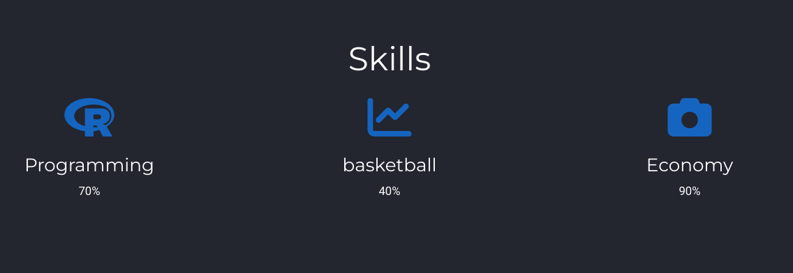
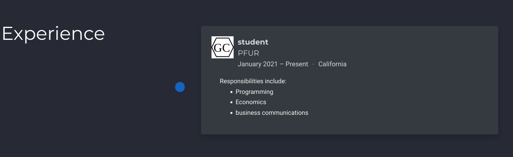
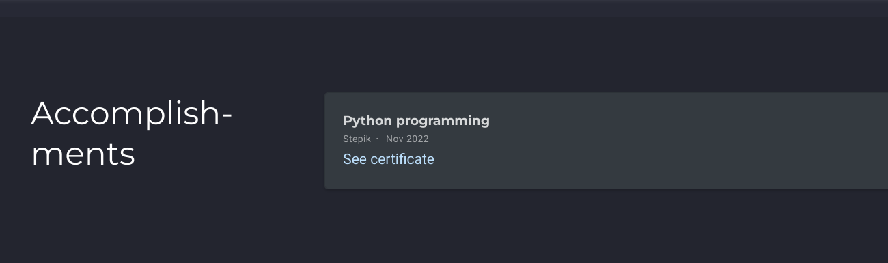
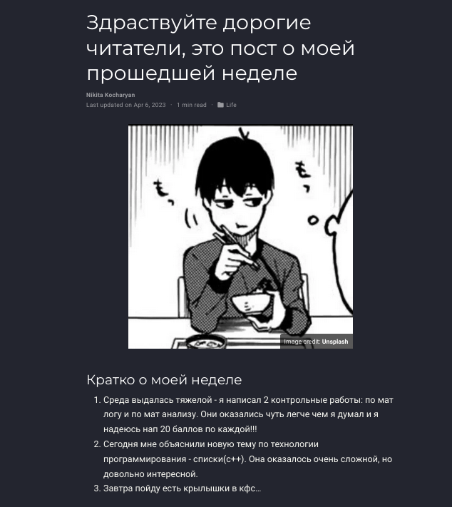
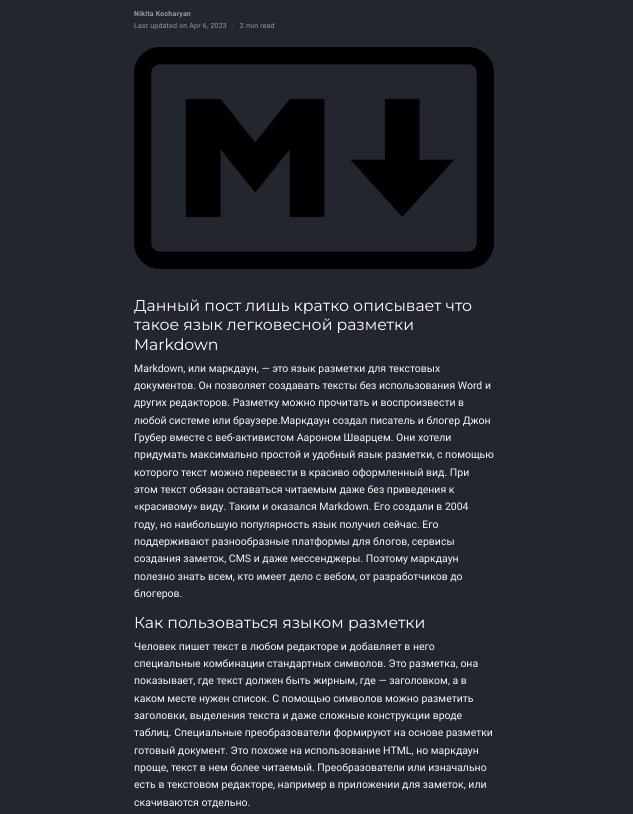
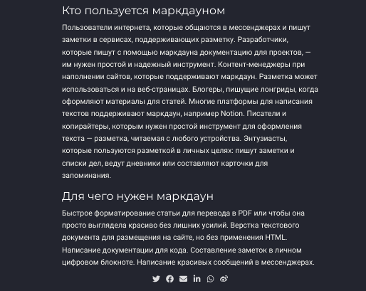

---
## Front matter
title: "Индивидуальный проект.3 этап."
subtitle: "Операционые системы"
author: "Кочарян Никита Робертович"

## Generic otions
lang: ru-RU
toc-title: "Содержание"

## Bibliography
bibliography: bib/cite.bib
csl: pandoc/csl/gost-r-7-0-5-2008-numeric.csl

## Pdf output format
toc: true # Table of contents
toc-depth: 2
lof: true # List of figures
lot: true # List of tables
fontsize: 12pt
linestretch: 1.5
papersize: a4
documentclass: scrreprt
## I18n polyglossia
polyglossia-lang:
  name: russian
  options:
	- spelling=modern
	- babelshorthands=true
polyglossia-otherlangs:
  name: english
## I18n babel
babel-lang: russian
babel-otherlangs: english
## Fonts
mainfont: PT Serif
romanfont: PT Serif
sansfont: PT Sans
monofont: PT Mono
mainfontoptions: Ligatures=TeX
romanfontoptions: Ligatures=TeX
sansfontoptions: Ligatures=TeX,Scale=MatchLowercase
monofontoptions: Scale=MatchLowercase,Scale=0.9
## Biblatex
biblatex: true
biblio-style: "gost-numeric"
biblatexoptions:
  - parentracker=true
  - backend=biber
  - hyperref=auto
  - language=auto
  - autolang=other*
  - citestyle=gost-numeric
## Pandoc-crossref LaTeX customization
figureTitle: "Рис."
tableTitle: "Таблица"
listingTitle: "Листинг"
lofTitle: "Список иллюстраций"
lotTitle: "Список таблиц"
lolTitle: "Листинги"
## Misc options
indent: true
header-includes:
  - \usepackage{indentfirst}
  - \usepackage{float} # keep figures where there are in the text
  - \floatplacement{figure}{H} # keep figures where there are in the text
---

# Цель работы

Добавить к сайту достижения.

# Задания

Список достижений.
	Добавить информацию о навыках (Skills).
        Добавить информацию об опыте (Experience).
        Добавить информацию о достижениях (Accomplishments).
Сделать пост по прошедшей неделе.
Добавить пост на тему по выбору:
	Легковесные языки разметки.
	Языки разметки. LaTeX.
	Язык разметки Markdown.

# Выполнение лабораторной работы

1.	Добавляю информацию о своих навыках благодаря редактированию файла index.md 

{#fig:01 width=90%}

2.	Добавляю информацию об опыте редактируя тот же файл index.md

{#fig:02 width=90%}

3.	Добавить информацию о достижениях редактируая файл index.md

{#fig:03 width=90%}

4.	Создаю пост о прошедшей неделе

{#fig:04 width=90%}

5.	Создаю пост на тему язык разметки Markdown

{#fig:05 width=50%}
{#fig:06 width=50%}

# Выводы

Я научился работать с сайтом, изменять информацию о себе на нем.

