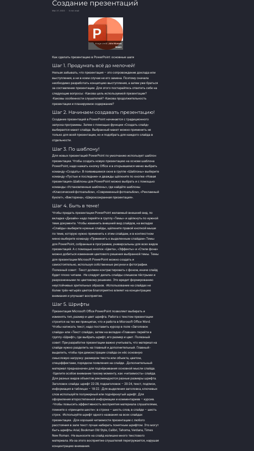

---
## Front matter
lang: ru-RU
title: Индивидуальный проект 4 этап.
subtitle: Операционные системы
author:
  - Кочарян Никита Робертович.
institute:
  - Российский Университет Дружбы Народов, Москва, Россия
date: 27 апреля 2023

## i18n babel
babel-lang: russian
babel-otherlangs: english

## Formatting pdf
toc: false
toc-title: Содержание
slide_level: 2
aspectratio: 169
section-titles: true
theme: metropolis
header-includes:
 - \metroset{progressbar=frametitle,sectionpage=progressbar,numbering=fraction}
 - '\makeatletter'
 - '\beamer@ignorenonframefalse'
 - '\makeatother'
---

# Информация

## Докладчик

:::::::::::::: {.columns align=center}
::: {.column width="70%"}

  * Кочарян Никита робертович
  * студент Российского Универстите Дружбы Народов
  * Российский университет дружбы народов

:::
::: {.column width="30%"}

:::
::::::::::::::

## Цели и задачи

Добавить к сайту ссылки на научные и библиометрические ресурсы

# Выполнение лабораторной работы

1.	Регистририруюсь на всех сайтах

{#fig:001 width=60%}

{#fig:002 width=60%}

##

{#fig:003 width=40%}

{#fig:004 width=40%}

##

{#fig:005 width=40%}

{#fig:006 width=40%}

##

{#fig:007 width=40%}

{#fig:008 width=40%}

##

{#fig:009 width=40%}

##

2.	Делаю пост о прошедшей неделе

{#fig:010 width=80%}

##

3.	Добавляю пост на тему: Создание презентаций

{#fig:011 width=40%}

{#fig:012 width=40%}

## Результаты

В ходе выполнения данной лабораторной работы я добавил к сайту ссылки на научные и библиометрические ресурсы, сделал пост о прошедшей неделе, добавил пост о создании презентаций 
